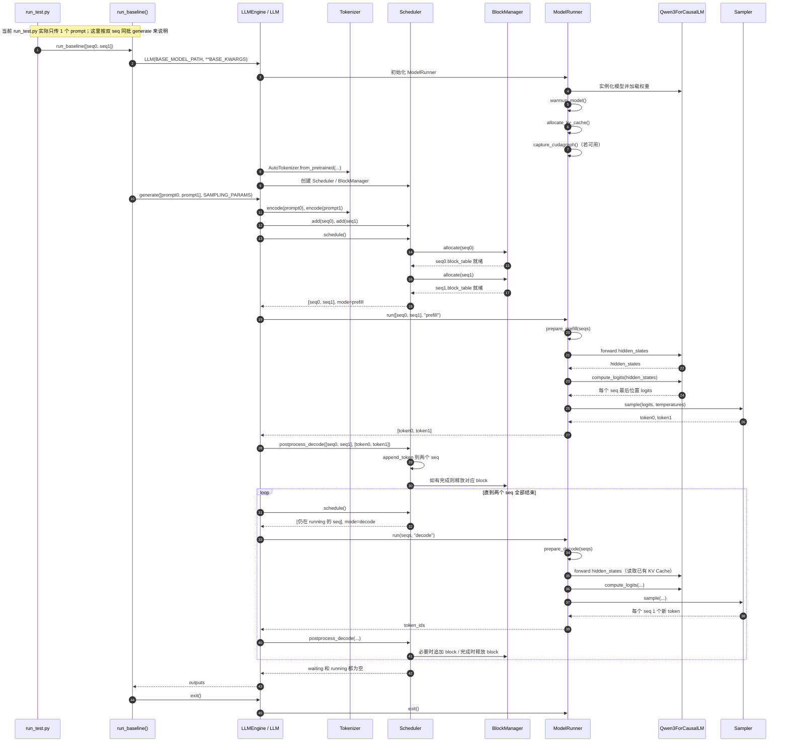
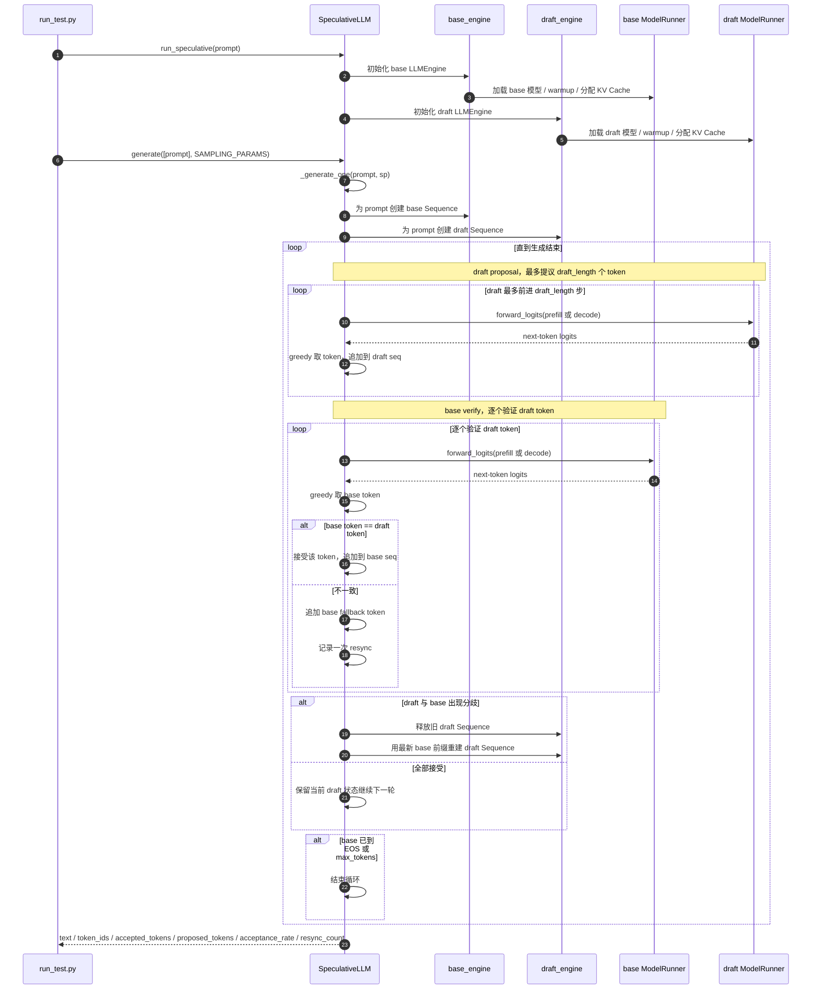

# nano-vllm 执行流程

本文整理的是当前仓库里 **单模型 baseline 路径** 的执行流程，也就是 `run_test.py` 里 `run_baseline(...)` 这一条链路。

为了贴近你说的场景，下面统一按 **两个 seq 同时进入 nano-vllm** 来说明。但要先说明一个关键点：

- `run_test.py:74` 当前实际执行的是 `run_baseline(prompt)`，里面只传了 **一个 prompt**
- 如果你想让两个 seq 同时进入同一个 `nano-vllm` batch，等价调用应该是：

```python
llm.generate([prompt_a, prompt_b], SAMPLING_PARAMS, use_tqdm=False)
```

- 如果你是连续调用两次 `run_baseline(prompt)`，那其实是 **两个独立的 engine 生命周期**，不是同一次 batch 调度

## 场景假设

这里假设：

- 使用 `run_test.py` 的 baseline 单模型路径
- 模型是 `LLM(BASE_MODEL_PATH, **BASE_KWARGS)`
- `tensor_parallel_size=1`
- 一次 `generate(...)` 里放入两个 prompt，也就是两个 `Sequence`
- KV Cache 足够，因此本次不会触发 `evict / preempt / recompute`

## 一句话总览

整体流程就是：

1. 初始化 `LLMEngine`
2. 初始化 `ModelRunner`，加载模型权重、预热、分配 KV Cache
3. `generate([seq0, seq1], ...)` 把两个请求转成两个 `Sequence`，塞进 `Scheduler.waiting`
4. 第一次调度走 `prefill`
5. 后续循环走 `decode`
6. 每一步都为每个 seq 生成 1 个 token
7. 任一 seq 生成到 EOS 或达到 `max_tokens` 时结束并释放 block
8. 两个 seq 都结束后，`generate(...)` 返回文本

## 入口链路

这条 baseline 路径的主调用链是：

```text
run_test.py
  -> run_baseline(...)
    -> LLM(...)
      -> LLMEngine.__init__
        -> ModelRunner.__init__
    -> llm.generate([...], sampling_params)
      -> LLMEngine.generate
        -> LLMEngine.add_request
        -> LLMEngine.step
          -> Scheduler.schedule
          -> ModelRunner.run
          -> Scheduler.postprocess_decode
```

## 启动阶段

注意：`run_baseline(...)` 里每调用一次，都会新建并销毁一个 `LLM`，所以启动成本也在 baseline 时间里。

### 1. `LLMEngine.__init__`

这里会完成几件事：

- 构造 `Config`
- 创建 `ModelRunner`
- 初始化 tokenizer
- 创建 `Scheduler`

这一步之后，engine 已经具备接收请求和执行 batch 的能力。

### 2. `ModelRunner.__init__`

这里会完成真正的推理初始化：

- 设置 CUDA device 和默认 dtype
- 实例化 `Qwen3ForCausalLM`
- 从 safetensors 加载权重
- 调用 `warmup_model()` 做一次预热
- 调用 `allocate_kv_cache()` 预分配 KV Cache
- 如果允许且环境支持，再捕获 decode 阶段的 CUDA Graph

所以在你的 baseline 里，真正开始 `generate(...)` 之前，模型其实已经：

- 在 GPU 上就位
- 做过一轮 warmup
- 绑定好了各层 attention 的 `k_cache / v_cache`

## 两个 seq 同时进入时的数据形态

当你调用：

```python
llm.generate([prompt_a, prompt_b], SAMPLING_PARAMS, use_tqdm=False)
```

会发生：

- `LLMEngine.add_request` 把两个 prompt 分别 tokenize
- 每个 prompt 包装成一个 `Sequence`
- 两个 `Sequence` 初始状态都是 `WAITING`
- 它们被追加到 `Scheduler.waiting`

此时关键状态大致是：

| 对象 | 状态 |
| --- | --- |
| `waiting` | `[seq0, seq1]` |
| `running` | `[]` |
| `seq0.status` | `WAITING` |
| `seq1.status` | `WAITING` |
| `seq0.block_table` | `[]` |
| `seq1.block_table` | `[]` |
| `seq0.num_cached_tokens` | `0` |
| `seq1.num_cached_tokens` | `0` |

## 第一次调度：Prefill

`generate(...)` 进入循环后，第一次 `step()` 会先调 `Scheduler.schedule()`。

因为此时 `waiting` 非空，所以会优先走 `prefill` 分支。

### 1. `Scheduler.schedule()` 从 waiting 里拿两个 seq

调度器会依次检查：

- 批量 token 数是否超过 `max_num_batched_tokens`
- `BlockManager` 是否还能为该 seq 分配 block

如果都满足：

- `BlockManager.allocate(seq0)`
- `BlockManager.allocate(seq1)`
- 两个 seq 从 `waiting` 移到 `running`
- 返回 `scheduled_seqs=[seq0, seq1], mode="prefill"`

### 2. `BlockManager.allocate(...)` 分配 block

这里会按 `Sequence.block_size=256` 来切 prompt。

对每个 seq：

- 计算这个 seq 一共需要几个 block
- 尝试做 prefix block 复用
- 如果没命中，就从 `free_block_ids` 里拿空闲 block
- 把分到的 block id 记进 `seq.block_table`

在你这个双 seq baseline 场景里，常见情况是：

- 两个 prompt 都比较短
- 两个 seq 各自只占 1 个未满 block
- 因为未满 block 不做 hash 复用，所以通常不会发生前缀缓存命中

### 3. `ModelRunner.run(seqs, "prefill")`

然后进入模型执行。

这一步做三件事：

1. `prepare_prefill(seqs)`
2. `forward_logits(...)`
3. `sample_from_logits(...)`

#### 3.1 `prepare_prefill(seqs)`

这里会把两个 seq 的 prompt 拼成一个扁平化 batch：

- `input_ids`：`seq0` 全部 prompt token + `seq1` 全部 prompt token
- `positions`：每个 token 在各自序列内的位置
- `cu_seqlens_q`：记录每个 seq 在扁平 batch 中的分界
- `cu_seqlens_k`：prefill 时和总长度一致
- `slot_mapping`：每个 token 要写入哪个 KV cache 槽位

如果设：

- `seq0` prompt 长度 = `L0`
- `seq1` prompt 长度 = `L1`

那么大概会得到：

```text
input_ids      = [seq0 的 L0 个 token, seq1 的 L1 个 token]
positions      = [0..L0-1, 0..L1-1]
cu_seqlens_q   = [0, L0, L0+L1]
cu_seqlens_k   = [0, L0, L0+L1]
```

#### 3.2 模型前向

`run_hidden_states(...)` 在 prefill 下直接 eager 前向：

- 输入扁平后的 `input_ids` 和 `positions`
- 模型逐层计算 hidden states
- attention 在内部把 K/V 写入提前分好的 KV Cache

然后 `compute_logits(...)` 通过 `lm_head` 取 logits。

这里有一个重要优化：

- prefill 阶段虽然会算完整 prompt 的 hidden states
- 但最终只保留 **每个 seq 最后一个位置** 的 logits 用于采样

也就是说，本轮会产出：

- `seq0` 的 next token logits
- `seq1` 的 next token logits

#### 3.3 采样

`Sampler` 根据每个 seq 的 temperature 对 logits 做 softmax + 采样，输出两个 token：

- `token0`
- `token1`

### 4. `Scheduler.postprocess_decode(...)`

这一轮虽然调度模式叫 `prefill`，但后处理仍然是统一的 `postprocess_decode(...)`：

- `seq0.append_token(token0)`
- `seq1.append_token(token1)`

然后对每个 seq 判断：

- 如果采到了 EOS，或者生成数达到 `max_tokens`
  - 标记为 `FINISHED`
  - 释放 block
  - 从 `running` 移除
- 否则继续保留在 `running`

经过这一轮后，两个 seq 都已经：

- 各自完成 prompt 的 prefill
- 各自拿到了第一个生成 token
- KV Cache 里已经有完整上下文

## 后续循环：Decode

只要还有未完成 seq，`generate(...)` 就会继续循环 `step()`。

此时 `waiting` 通常已经空了，所以 `Scheduler.schedule()` 会走 decode 分支。

### 1. Decode 调度

对于 `running` 里的 `seq0`、`seq1`：

- 检查能否 append 到当前 block
- 如果当前 block 满了，而新 token 会进入下一个 block，就从 `BlockManager` 申请新 block
- 然后把这两个 seq 作为本轮 decode batch 返回

### 2. `prepare_decode(seqs)`

decode 和 prefill 最大的区别是：

- prefill 输入的是“所有还没算过的 token”
- decode 输入的是“每个 seq 最后一个 token”

所以这里会构造：

- `input_ids = [seq0.last_token, seq1.last_token]`
- `positions = [len(seq0)-1, len(seq1)-1]`
- `context_lens = [len(seq0), len(seq1)]`
- `slot_mapping = [seq0 最后 token 的 KV 槽位, seq1 最后 token 的 KV 槽位]`
- `block_tables = [seq0 的 block_table, seq1 的 block_table]`

### 3. Decode 前向

`run_hidden_states(...)` 在 decode 下可能走两种路径：

- `enforce_eager=True` 或 CUDA Graph 不可用：直接 eager 前向
- 否则：走已经捕获好的 CUDA Graph replay

但不管底层是哪种执行方式，语义上都是一样的：

- 用两个 seq 的最后一个 token 作为 query
- 读取各自已有的 KV Cache
- 算出下一个位置的 hidden state
- 再经 `lm_head` 得到两个 seq 的 logits

### 4. 采样并更新

接着：

- `Sampler` 采出两个 next token
- `postprocess_decode(...)` 把 token 追加回两个 seq
- 判断是否结束
- 未结束的继续留在 `running`

这个循环会一直重复，直到两个 seq 都完成。

## 正常双 seq 场景下的状态演化

如果资源充足、没有驱逐，状态变化通常是：

| 时刻 | waiting | running | 说明 |
| --- | --- | --- | --- |
| 调用 `generate` 前 | `[]` | `[]` | engine 已初始化 |
| 两个请求 add 后 | `[seq0, seq1]` | `[]` | 两个 seq 等待进入 batch |
| 第一次 schedule 后 | `[]` | `[seq0, seq1]` | 两个 seq 进入 prefill |
| 第一次 postprocess 后 | `[]` | `[seq0, seq1]` 或部分完成 | 两个 seq 各拿到 1 个生成 token |
| 多轮 decode 中 | `[]` | `[未完成 seq]` | 每轮每个存活 seq 生成 1 token |
| 全部结束后 | `[]` | `[]` | `generate(...)` 返回 |

## 时序图

下面这张图画的是“**两个 seq 在同一个 baseline generate 调用里一起进入**”的时序。



## 你真正关心的几个点

### 1. 两个 seq 是什么时候“合批”的

是在 `Scheduler.schedule()` 的 prefill 阶段：

- 只要两个请求都在 `waiting`
- 且没有超过 `max_num_seqs` 和 `max_num_batched_tokens`
- 就会一起作为一个 batch 送给 `ModelRunner`

### 2. Prefill 和 Decode 的输入有什么不同

- prefill：输入每个 seq 全部未缓存 token
- decode：输入每个 seq 最后一个 token

这也是为什么 prefill 算得重、decode 算得轻。

### 3. 两个 seq 会不会互相影响

在调度层面，它们共用一个 batch 和同一块 GPU 时间片。

在 KV Cache 层面：

- 每个 seq 有自己的 `block_table`
- 每个 token 写入自己的 KV slot
- 逻辑上是隔离的

只有在 prefix cache 命中时，两个 seq 才可能共享已经缓存好的 block。

### 4. 为什么 decode 每轮只生成 1 个 token

因为 baseline 单模型路径就是标准 autoregressive decode：

- 本轮拿到当前最后一个 token
- 预测下一个 token
- 把新 token 追加回序列
- 下一轮再继续

## 简易 Speculative Decode 流程

这一节对应的是 `run_test.py` 里的：

```python
speculative = run_speculative(prompt)
```

也就是：

```python
llm = SpeculativeLLM(
    BASE_MODEL_PATH,
    DRAFT_MODEL_PATH,
    draft_length=4,
    base_kwargs=BASE_KWARGS,
    draft_kwargs=DRAFT_KWARGS,
)
output = llm.generate([prompt], SAMPLING_PARAMS, use_tqdm=False)[0]
```

## 先说结论

当前这版 speculative decode 是一个 **单请求 MVP**，特点是：

- 同时初始化两个 engine：`base_engine` 和 `draft_engine`
- 不走原来 `LLMEngine.generate -> Scheduler.schedule` 那套批量调度主循环
- 一次只处理一个 prompt
- draft 先连续提议最多 `draft_length` 个 token
- base 再逐 token 验证这些提议
- 一旦出现分歧，就把 base 的真实 token 接上，并重建 draft 状态对齐前缀

所以它的重点是先把 **proposal / verify / resync** 这条逻辑跑通，而不是先追求高性能批处理。

## 主调用链

当前 speculative 路径的主链路是：

```text
run_test.py
  -> run_speculative(...)
    -> SpeculativeLLM(...)
      -> LLMEngine(base_model)
      -> LLMEngine(draft_model)
    -> speculative_llm.generate([prompt], sampling_params)
      -> _generate_one(...)
        -> _propose_with_draft(...)
        -> _verify_with_base(...)
        -> 可能触发 resync
```

## 启动阶段

和 baseline 最大的区别是：这里会初始化两套独立推理引擎。

- `base_engine`：大模型，负责最终“拍板”
- `draft_engine`：小模型，负责先提议 token

两边都会各自完成：

- `LLMEngine.__init__`
- `ModelRunner.__init__`
- 模型加载
- warmup
- KV Cache 分配

也就是说，从资源角度看，它本质上是两套独立的 nano-vllm 单模型引擎同时驻留。

## 单请求状态

当前实现不是多请求 batch 调度，而是对每个 prompt 单独做一轮 `_generate_one(...)`。

在 `_generate_one(...)` 里，会先基于同一个 prompt 构造两份 `Sequence`：

- `base_state.seq`
- `draft_state.seq`

它们的初始前缀完全相同，但分别挂在：

- `base_engine.scheduler.block_manager`
- `draft_engine.scheduler.block_manager`

也就是说：

- base 有自己的一套 KV cache block
- draft 也有自己的一套 KV cache block
- 两边不会共享 block table

## 一轮 speculative step 在做什么

整个生成循环可以理解成不断重复下面三段：

1. draft 提议一小段 token
2. base 逐个验证这些 token
3. 如果不一致，就重建 draft 前缀

### 1. Draft proposal

`_propose_with_draft(...)` 会让 draft 连续跑最多 `draft_length` 步。

比如 `draft_length=4`，那一轮里 draft 最多先提议：

```text
[d1, d2, d3, d4]
```

这一步内部仍然复用了 `ModelRunner.forward_logits(...)`：

- 第一步通常走 `prefill`
- 后续几步走 `decode`

只是这里不是通过 `Scheduler.schedule()` 来批量组织，而是直接拿着单个 `Sequence` 去前向。

如果 draft 在提议过程中已经碰到 EOS 或达到 `max_tokens`，这一轮 proposal 会提前结束。

### 2. Base verify

`_verify_with_base(...)` 会按顺序逐个验证 draft 提议的 token。

如果 draft 提议的是：

```text
[d1, d2, d3, d4]
```

那么 base 会这样做：

1. 用当前真实前缀算下一个 token
2. 看 base 预测是不是 `d1`
3. 如果是，就接受并继续验证 `d2`
4. 如果不是，就拒绝，从 base 自己的结果里取真实 token 作为 fallback

所以当前 verify 不是“一次性并行验证整段”，而是：

- base 逐 token 地滚动前向
- 每验证成功一个 token，就把它 append 到 `base_state.seq`

这也是为什么它叫“简易版本”。

## 接受和拒绝

一轮 verify 后有两种结果。

### 情况 A：全部接受

如果 base 对这一轮 proposal 全部同意：

- `accepted_count == len(proposal_token_ids)`
- base 前缀直接推进整段
- draft 不需要重建
- 下一轮继续从当前 draft 状态往后 proposal

### 情况 B：中途拒绝

如果某个位置开始 base 和 draft 不一致：

- base 只接受前面那部分一致的 token
- 然后把自己的真实 token 作为 fallback token 接到 `base_state.seq`
- 这说明 draft 的内部状态已经和真实前缀脱离

于是当前实现会直接：

1. 释放旧的 `draft_state`
2. 用最新的 `base_state.seq.token_ids` 重新创建一个新的 `draft_state`
3. 让 draft 从真实前缀重新开始

这个过程在代码里叫 `resync_count += 1`。

## 一句话理解当前 MVP

当前版本不是“draft 连续猜、base 一次性批量验证整段”的高性能实现，而更像：

- draft 先多猜几步
- base 再一步一步检查
- 一旦错了就把 draft 拉回到 base 的真实前缀

所以它的价值主要是：

- 验证 speculative decoding 的控制流是否正确
- 验证 acceptance / rejection / resync 统计是否合理
- 给后续更高性能的 verify 实现打基础

## 当前 speculative 路径的时序图

下面这张图画的是当前仓库里这版 **单请求简易 speculative decode** 的执行方式。



## 和 baseline 的主要区别

你可以把当前 speculative 版本和 baseline 对比着理解：

| 维度 | baseline 单模型 | 当前 speculative MVP |
| --- | --- | --- |
| 模型数 | 1 个 base 模型 | 1 个 base + 1 个 draft |
| 调度方式 | `Scheduler` 批量调度 | 单请求手写循环 |
| 请求粒度 | 可 batch 多个 seq | 当前按 prompt 逐条处理 |
| 每轮生成 | 每个 seq 1 个 token | draft 最多提议 `draft_length` 个，base 再逐个验 |
| 拒绝处理 | 不存在 | base fallback + draft resync |
| 当前目标 | 正常自回归生成 | 先验证 speculative 控制流 |

## 本文没有展开的分支

为了聚焦你现在这条 baseline 双 seq 路径，这里没有展开：

- prefix eviction / recompute 的详细分支
- 多卡 tensor parallel 下的共享内存广播细节

如果你后面要，我可以继续把这份文档补成第二版，把：

- speculative verify 的高性能版本该怎么改
- `recompute` 分支
- CUDA Graph 命中路径
- Attention 内部如何写 KV Cache

再单独画成更细的图。
