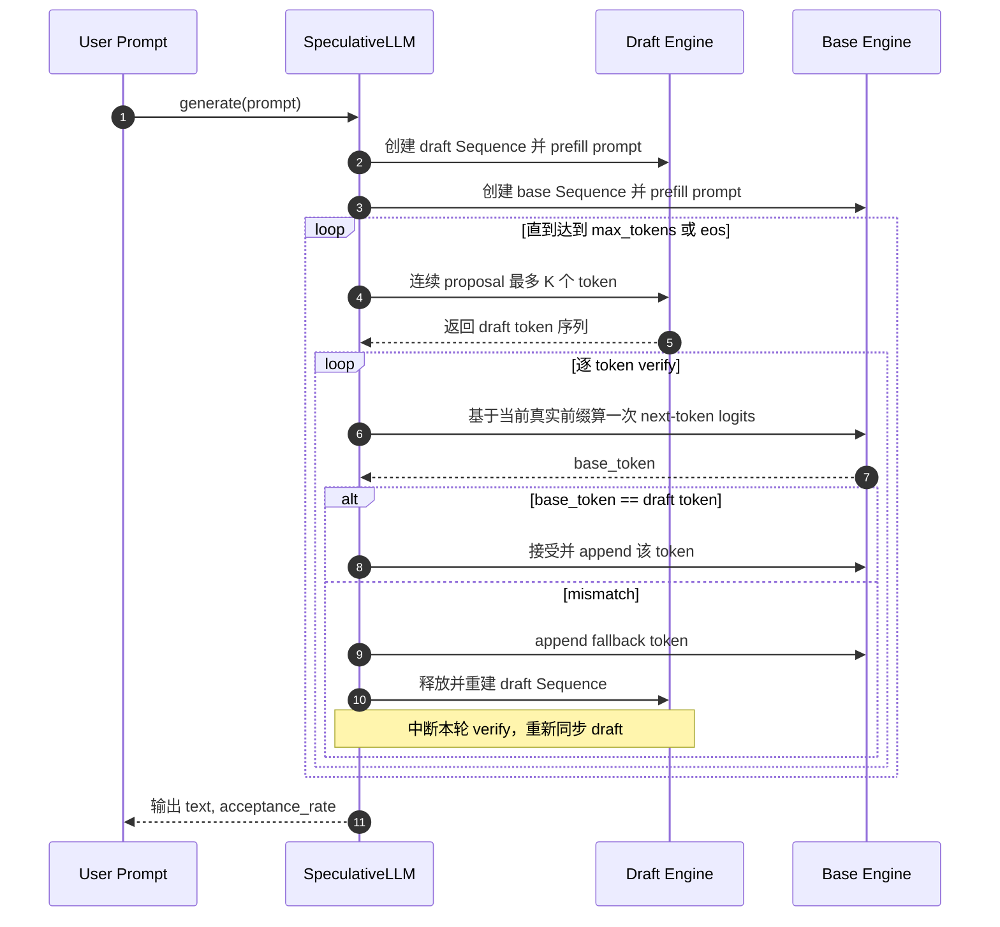
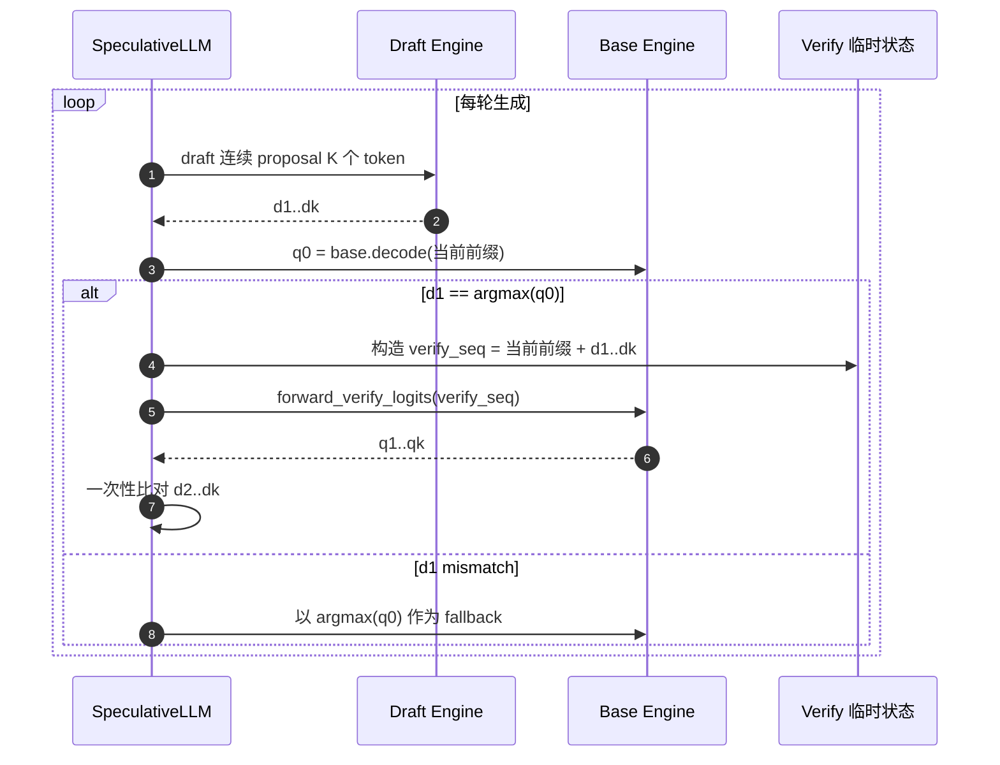
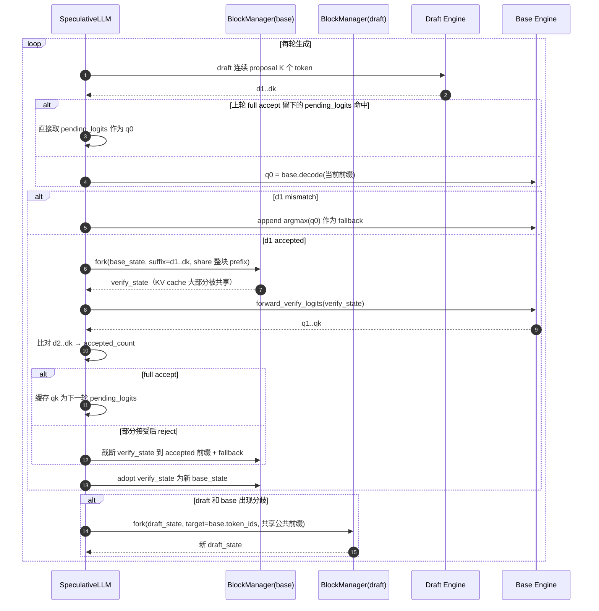
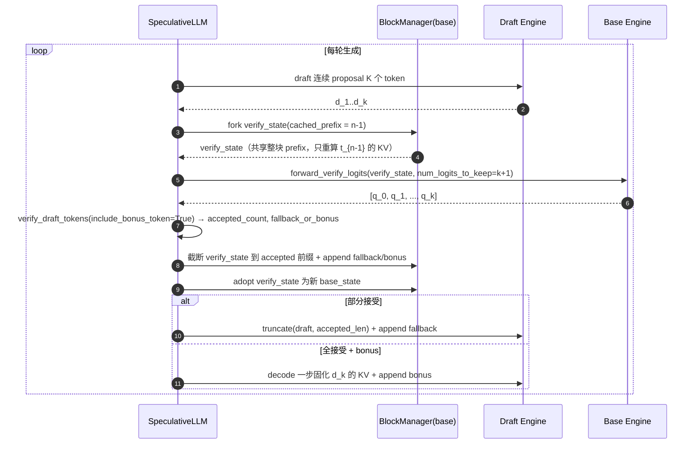

# Speculative Decoding 方案设计

本文档按「版本演进」重新整理了 `nano-vllm` 里 speculative decoding（下文简称 SD）的实现路线，方便后续对比每一版到底解决了什么问题、还剩什么问题。

- 目标：给 `Qwen3-4B`（base）+ `Qwen3-0.6B`（draft）做一套可控、可度量、可渐进优化的 speculative decoding 实现。
- 路线：**保留单模型引擎不动 → 新增 `SpeculativeLLM` → 每个版本只往前推一步，不堆大改**。

## 1. 背景与动机

### 1.1 为什么是 external draft + base，而不是 MTP

- 现有项目结构是单模型 + 单 `LLMEngine` 的经典路线。
- 已经同时下载了 `Qwen3-4B` 和 `Qwen3-0.6B`，非常契合「大模型 + 小草稿」这种经典 SD 配置。
- MTP 需要训练新头，而 external draft 不需要，对这个项目更现实。

### 1.2 项目关键约束

当前生成主循环是单模型思路：

```51:58:nanovllm/engine/llm_engine.py
def step(self):
    seqs, mode = self.scheduler.schedule()
    token_ids = self.model_runner.call("run", seqs, mode)
    if mode == "recompute":
        self.scheduler.postprocess_recompute(seqs)
    else:
        self.scheduler.postprocess_decode(seqs, token_ids)
    outputs = [(seq.seq_id, seq.completion_token_ids) for seq in seqs if seq.is_finished]
```

而且原来的 `Sequence` 只能承担「一个序列对应一个模型」的状态：

```19:35:nanovllm/engine/sequence.py
def __init__(self, token_ids: list[int], sampling_params = SamplingParams()):
    self.seq_id = next(Sequence.counter)
    self.status = SequenceStatus.WAITING
    self.token_ids = copy(token_ids)
    self.last_token = token_ids[-1]
    self.num_tokens = len(self.token_ids)
    self.num_prompt_tokens = len(token_ids)
    self.num_cached_tokens = 0
    self.block_table = []
    self.prefix_block_table = []
    self.pending_recompute_block_ids = []
    self.evicted_prefix_blocks = 0
    self.recompute_pending = False
    self.keep_last_blocks = 0
    self.temperature = sampling_params.temperature
    self.max_tokens = sampling_params.max_tokens
    self.ignore_eos = sampling_params.ignore_eos
```

所以 SD 最大的结构变化不是采样逻辑，而是：**一个用户请求要同时维护 base 和 draft 两套状态**。

### 1.3 总体策略（不变，贯穿所有版本）

- 不改坏 `LLMEngine`，新增 `SpeculativeLLM` 作为上层调度
- 内部持有两个 `LLMEngine`（base / draft），各自管好自己的 KV cache
- 只要求同家族 tokenizer、同 eos、同 vocab size
- 单请求先跑通，然后再考虑 batch / scheduler 融合

## 2. 版本演进全貌

| 版本 | 关键词 | 一句话概括 | 状态 |
| --- | --- | --- | --- |
| V0 | 逐 token verify | MVP，先把闭环跑通 | 已被替代 |
| V1 | q0 + 整段 verify | verify 接口打通，路径正确化 | 已被替代 |
| V2 | 去 replay + adopt verify_state | 削掉最重的 base 额外开销 | 已被替代 |
| V3 | 增量状态复用 | verify / resync 都走增量 fork，partial block 也能复用 | 已被替代 |
| V4.0 | fused q0 + verify | 每轮 base 只做一次 prefill(k+1)，全接受自动吃 bonus | 已被替代 |
| V4.1 | 消灭 Case C dummy decode | draft 侧多 uncached token 走 prefix-cache prefill，一次算完 `[d_k, bonus]` | **当前版本** |
| V4.2+ 目标 | Python / CPU-GPU 同步清理 | `verify_draft_tokens` tensor 化、fork 循环压成向量化 | 规划中 |

后面每一节会按「目标 / 主要改动 / 时序图（可选）/ 性能观察 / 剩余问题」五个维度讲。

## 3. V0：最小闭环（逐 token verify）

### 3.1 目标

先把双模型控制流跑通，验证：

- 单卡能同时装下 4B + 0.6B
- `SpeculativeLLM` 能正确串联两个 `LLMEngine`
- greedy 路径下语义正确

### 3.2 主要改动

- `ModelRunner`
  - 单卡场景不再强制初始化 `torch.distributed` 默认进程组
  - `run()` 拆成 `forward_hidden_state / forward_logits / sample_from_logits`
- `SpeculativeLLM`
  - 每个请求各自维护一条 `base Sequence` 和 `draft Sequence`
  - draft 连续 proposal `K` 个 token
  - base 对这些 proposal **逐 token** 判决
  - mismatch 后直接整轮重建 draft `Sequence`

### 3.3 时序图



### 3.4 限制

- base 前向次数几乎没减少
- 每次 mismatch 都会重建 draft，代价重
- verify 接口能力没真正用上（只是在反复跑 decode）

## 4. V1：q0 + 整段 verify 打通

### 4.1 目标

第一次把 verify 真正改成「**整段 verify**」：base 不再逐 token 决策，而是一次拿到 `q1..qk`。

### 4.2 主要改动

- `Qwen3ForCausalLM.compute_logits()` 新增 `only_last_token` 参数
- `ParallelLMHead.forward()` 同步新增 `only_last_token`
- `ModelRunner` 新增：
  - `forward_verify_logits()`：保留 prefill 全部位置 logits
  - `verify_draft_tokens()`：只做 token 比较，不改外部 `Sequence`
- `SpeculativeLLM._verify_with_base()` 的新形态：
  1. 先跑一次 decode 拿 `q0`，判决 `d1`
  2. 如果 `d1` 接受，再对整段 draft suffix 做一次 verify prefill，拿 `q1..qk`
  3. 用 `q1..q{k-1}` 判决 `d2..dk`

### 4.3 时序图



### 4.4 性能观察

- 能正确跑通，`acceptance_rate` 合理
- 但 base 前向还是很多：`q0` + verify prefill 基本是双段
- 而且这时还有一个隐藏 bug：**accepted token 的 KV 没同步回 `base_state`**
  - 详见附录 A.1

### 4.5 限制

- verify 阶段 `LMHead` 会先对整段 hidden states 投影，再切片 → 容易 OOM（附录 A.2）
- full-accept 情况下 `qk` 没被复用（bonus token 收益没吃）
- 「mismatch 后整轮重建 draft」还没解决

## 5. V2：去掉最重的 base 额外开销

### 5.1 目标

V1 的正确性修好之后，先砍掉最重的那条 base 开销：**`_commit_base_tokens()` 的顺序 replay**。同时顺手把 full-accept 的 bonus token 收益接回来。

### 5.2 主要改动

- 彻底移除 `_commit_base_tokens()`
- `_verify_with_base()` 不再只返回「判决结果」，而是直接产出新的 `base_state`
  - 如果前缀被接受，就**直接接管 `verify_state`**
  - 对未接受尾部：先截断 `verify_state` 到 accepted 前缀，再 append fallback
- full-accept 时，把 verify 阶段的 `qk` 塞进新状态的 `pending_logits`
  - 下一轮 base 的第一次 `q0` 查询直接命中 pending_logits，省一次 base decode
- `forward_verify_logits()` 改成「**先切 hidden states、再算 logits**」，彻底解掉附录 A.2 的 OOM
- 禁用 `RMSNorm / SiluAndMul` 的 `@torch.compile`，规避 dynamo 重编译
- 修复 `attention.py` 在 paged prefill 分支里把当前步 k/v 误传给 FlashAttention 的问题（附录 A.4）

### 5.3 性能观察

- 从 V1 的 `~0.54x` 提到 `~0.62x`
- acceptance rate 基本稳定，说明正确性没退化

### 5.4 限制

- `verify_state` 依然是**整轮重建**：每次都 `_make_sequence(prefix + draft_suffix)`，从头 allocate 一遍 block
- mismatch 时 `draft_state` 还是整轮重建
- base 真正的 `q0 + verify prefill` 双段结构没变

## 6. V3：增量状态复用

### 6.1 目标

把「**状态重建**」这条剩下的结构性开销也砍掉：

- `base → verify_state` 走增量 fork
- `draft → resync` 也走增量 fork
- 最后未满块的 KV 不再「被迫重算」

### 6.2 主要改动

- 新增 `_fork_sequence_from_state(engine, state, target_token_ids, cached_prefix_tokens)`：
  - 共享 source `block_table` 中完全 cached 的整块（`ref_count += 1`）
  - 如果 `cached_prefix_tokens` 落在最后未满块里，就把这段 KV **拷贝**到一个新块
  - 只为真正新增的 suffix 额外分配块
- `_verify_with_base()` 从 `_make_sequence()` 切换到 `_fork_sequence_from_state()`，复用 `base_state.num_cached_tokens`
- draft resync 也不再 `_make_sequence()`，而是：
  - 计算 `common_prefix_length(draft.token_ids, base.token_ids)`
  - 从 draft_state fork 出新 draft_state，最大限度复用 draft 自己的 KV
- `_next_logits()` 在 prefill/decode 后把 `num_cached_tokens` 更新到「精确 token 数」，不再按整块粗估
- `prepare_prefill()` 支持「部分 cached block」：
  - 从 `uncached_start` 开始构造 `slot_mapping`
  - 对最后未满 cached block，只写未缓存的那段
  - 这样 verify prefill 不会重复计算前面已经命中的 token

### 6.3 时序图



### 6.4 性能观察

典型一次基准（`draft_length=2`、`max_tokens=128`、`temperature=1e-5`、`<think>` 风格 prompt）：

- baseline 4B：`~19.9 tok/s`
- speculative：`~13.3 tok/s`
- `accepted_tokens = 88`
- `proposed_tokens = 150`
- `acceptance_rate ≈ 0.59`
- `resync_count = 40`
- `speedup_vs_baseline ≈ 0.67x`

用这些数字反推一下：

- 一共 ~75 轮 proposal
- 全接受轮 ~35 轮，贡献 70 accepted token
- 其中 `d1 过了但 d2 没过` 的轮次 ~18 轮
- `d1 就没过` 的轮次 ~22 轮
- base 4B 的实际前向次数大约 `q0 + verify ≈ 90+ 次`，而 baseline 是 128 次

也就是说，**base 前向次数确实降了，但降得还不够狠**，这是 V3 的真实瓶颈。

### 6.5 剩余问题

- V3 削掉的主要是「状态管理的固定成本」，不是「base 计算复杂度」
- `q0` 和 verify prefill 还是两段，大量轮次都要跑两次 base
- partial cached block 会触发一次「KV 块拷贝」，比重算便宜，但不是零成本
- 当前 benchmark 的 `<think>` prompt 对 draft 非常不友好，会放大上面的问题

## 7. V4.0：fused q0 + verify（当前版本）

### 7.1 目标

V3 的瓶颈是**每轮 base 还要跑两次前向**（`decode` 拿 `q0` + `prefill(k)` 拿 `q1..qk`）。
V4.0 的目标是把它们合并成**一次** `prefill(k+1)`，并顺手吃到 `bonus token`。

### 7.2 核心洞察

`q0..qk` 是同一个 causal attention 下连续 `k+1` 个 query 位置的输出：

- query at pos `n-1` → 基于 `t_0..t_{n-1}` 预测，即 `q_0`
- query at pos `n` → 基于 `t_0..t_{n-1}, d_1` 预测，即 `q_1`
- ...
- query at pos `n+k-1` → 基于 `t_0..t_{n-1}, d_1..d_k` 预测，即 `q_k`

这些 query 完全可以一次 FlashAttention 前向拿到。区别只是 verify_state 的 query 长度从 `k` 涨到 `k+1`，多出来的那个 query 位置 `n-1` 对应的 token 是 `t_{n-1}`，它的 K/V 需要被重算并写入 verify_state 的新 block（等价于原 K/V，只是多算 1 个 token 的 attention）。

### 7.3 主要改动

- `_verify_with_base()` 重写为 fused 版本：
  - fork verify_state 时 `cached_prefix_tokens = base.num_cached_tokens - 1`
  - 一次 `forward_verify_logits(num_logits_to_keep=k+1)` 拿 `[q_0..q_k]`
  - `verify_draft_tokens(..., include_bonus_token=True)` 做一次性比对
    - 部分接受 → `fallback_token_id = argmax(q_{accepted})`
    - 全部接受 → `fallback_token_id = argmax(q_k)` 即 bonus
- `_adopt_base_verify_state()` 简化：
  - 不再接收 `bonus_logits`
  - `fallback_token_id is not None` 统一 append 到 verify_state（fallback 和 bonus 语义合并）
- `_SequenceState.pending_logits` 字段和 `_next_logits()` 里对应的分支**整条删除**（V4 下每轮都靠 fused verify 生成下一轮的 last_token，不再需要跨轮缓存 logits）
- `_generate_one()` 里的 draft 对齐改走更便宜的 `truncate + append`：
  - **Case A/B（部分接受）**：截断 draft 到 accepted 长度（顺带丢弃 `d_k` 的未算 KV），再 append fallback
  - **Case C（全接受 + bonus）**：先让 draft 做一次 decode 固化 `d_k` 的 KV（logits 丢弃），再 append bonus
  - 这样 draft 维持「末尾 1 token KV 未算」的稳态不变量

### 7.4 时序图



### 7.5 每轮 base 成本对比

| 场景 | V3 的 base 成本 | V4.0 的 base 成本 | 备注 |
|---|---|---|---|
| A: `d_1` miss | 1 × decode(1) | 1 × prefill(k+1) | 多算 k 个 token（主要的亏点） |
| B: 部分接受 | 1 × decode(1) + 1 × prefill(k) | 1 × prefill(k+1) | 少一次 launch |
| C: 全接受 | 1 × decode(1) + 1 × prefill(k) | 1 × prefill(k+1)，顺手拿 bonus | 少一次 launch + 多接 1 个 token |

每轮 base forward 永远只有一次调用，CUDA launch 次数显著减少。

### 7.6 实测结果（k=2, `<think>` 长推理 prompt, enforce_eager=True）

| 指标 | V3 | V4.0 | 变化 |
|---|---|---|---|
| baseline 4B | 19.9 tok/s | 21.5 tok/s | 基线略有波动 |
| speculative | 13.31 tok/s | **16.54 tok/s** | +24% |
| `speedup_vs_baseline` | 0.668x | **0.771x** | +0.10 |
| `accepted_tokens` / `proposed_tokens` | 88 / 150 | 71 / 115 | 轮数减少 |
| `acceptance_rate` | 0.587 | 0.617 | 基本持平 ✅ |
| `resync_count`（只记部分接受） | 40 | 28 | -30% |
| `generated_tokens` | 128 | **129** | bonus token 真的被接受了 ✅ |

从 `(accepted=71, proposed=115, resync=28, generated=129)` 反推轮次分布：

- 总轮数 R = 129 - 71 ≈ 58 轮（V3 是 75 轮，**直接少 17 轮 base prefill**）
- 按 `{X=全接受+bonus, Y=部分接受, Z=零接受}` 解方程 → X=30, Y=11, Z=17
- 30 轮全接受每轮产出 3 个 token（d_1, d_2, bonus），是 V4 相对 V3 多出来的主要增益来源

### 7.7 剩余 overhead 的来源分析

baseline 47ms/tok，V4.0 实测 60ms/tok，平均每轮 ~134ms 产 2.22 个 token。相对 baseline 的等量输出多花 ~30ms/轮：

| 来源 | 估计耗时 / 轮 |
|---|---|
| draft 2 次 decode (0.6B) | ~10ms |
| Case C 下多跑的那次 dummy decode（52% 命中率） | ~3ms |
| verify_state fork（含 partial block KV 拷贝） | ~3-5ms |
| Python 控制流 + `.tolist()` + tensor 准备 | ~10ms |
| base `prefill(k+1)` vs baseline `decode(1)` 的单次差 | ~5ms |
| 合计 | ~30ms ✅ |

没有隐藏退化，剩余的都是「小批量前向 + Python 开销 + draft cost」构成的结构性天花板。

### 7.8 横向 prompt 矩阵 & `draft_length` 敏感度分析

V4.0 落地后做过一次多维度对比实验，目标是验证两个假设：

- H1：`<think>` 长推理是最坏情况，换短答案 / 模板化 prompt 应该能显著提升 speedup
- H2：`draft_length = 3` 能在 draft 友好的段落里吃到更多 bonus，是动态调节的入口

#### 7.8.1 测试方法

- 5 种 prompt，同一份 `<|im_start|>` chat 模板：`think_long` / `short_qa` / `factual_list` / `template_code` / `casual_chat`
- `max_tokens = 128`, `temperature = 1e-5`
- 引擎加载 1 次，跑完全部 prompt（避免反复 warmup 引入偏差）
- `draft_length ∈ {2, 3}`，通过直接修改 `SpeculativeLLM.draft_length` 切换，不重载模型

#### 7.8.2 结果矩阵

| prompt | baseline tok/s | k=2 tok/s | k=2 speedup | k=2 accept | k=3 tok/s | k=3 speedup | k=3 accept |
|---|---|---|---|---|---|---|---|
| think_long     | 22.46 | 16.86 | 0.75x | 0.62 | 16.80 | 0.75x | 0.50 |
| short_qa       | 25.36 | 18.44 | 0.73x | 0.65 | 17.22 | 0.68x | 0.53 |
| factual_list   | 25.43 | 17.14 | 0.67x | 0.54 | 16.09 | 0.63x | 0.47 |
| template_code  | 25.29 | 17.97 | 0.71x | 0.67 | **18.34** | **0.73x** | 0.61 |
| casual_chat    | 25.37 | 16.95 | 0.67x | 0.54 | 16.94 | 0.67x | 0.52 |

#### 7.8.3 关键发现

**① H1 几乎不成立：prompt 类型的差异远小于预期**

5 个 prompt 的 acceptance rate 全部落在 `0.54 ~ 0.67` 这个狭窄区间。原因是 Qwen3 是经过 chat-tuning 的 think-style 模型，不管问什么都倾向于先 `<think>...` 走一段推理链。我们其实是在测「5 种前缀下 Qwen3 思考同一件事的前 128 token」，本质上都是开放式推理。

→ **想通过换 prompt 绕开 speculative 瓶颈，收益有限**。真正想大幅提升 acceptance，要从模型侧走（EAGLE / MTP 头 / 蒸馏后的 draft），已经不是工程问题。

**② H2 只在 `template_code` 上成立：k=3 不是通用增益**

k=2 → k=3 的效果：

- `template_code`：+2%（唯一正向，acceptance 0.67 → 0.61 降得少）
- `think_long` / `casual_chat`：基本持平
- `short_qa` / `factual_list`：-6% ~ -7%（acceptance 大幅下滑到 0.47-0.53）

用朴素 Bernoulli 模型反推单 token 接受概率 `p`：

- `k=2 think_long`：`(p + p²)/2 ≈ 0.62` → `p ≈ 0.72`
- `k=3` 同 prompt 理论预测 `≈ 0.54`，实测 `0.50`（略低，说明后位 draft 条件概率更差）

→ **临界点：acceptance rate ≥ 0.6 左右 k=3 才正向**，否则 k=3 纯增加开销。

**③ acceptance rate 的天花板解释**

`template_code` 的 0.67 差不多就是 `Qwen3-0.6B 预测 Qwen3-4B` 在同家族同分词器下的结构天花板。对比公开基准：

- Llama 1.1B + 70B 在 greedy 下 acceptance 通常 0.7-0.8
- Llama 7B + 70B 可以到 0.85+

我们这里 0.6B + 4B 的 0.67 属于「小 draft 合理水平」，继续推高要靠训练（EAGLE / Medusa / MTP）。

**④ baseline 本身存在 warmup 偏差**

`think_long` 是第一个 prompt，baseline = 22.46 tok/s；后面 4 个 prompt 复用 warmup 后的状态，稳定在 25.3-25.4 tok/s。这意味着：

- 以前单 prompt 跑的 baseline 数字（19.9 / 21.5）都包含 warmup，偏低
- V4.0 的真实 speedup 大约 `17 / 25 ≈ 0.68x`，比「0.77x」更接近结构真相
- 之前「越来越接近 1.0x」的感觉，一部分是 warmup 摊薄带来的错觉

#### 7.8.4 这次实验对 V4.1 优先级的影响

基于以上发现，原计划里「动态 draft_length」的收益预估要下调。

- `template_code` 之外的 4 个 prompt，k=3 都不增益或负收益
- 即使上动态策略，收益窗口只在 acceptance ≥ 0.6 的短段落里
- 全套件加权预期增益 **< 1%**
- 实现成本：需维护 running acceptance 估计器 + 调度策略

相比之下：

- Case C dummy decode 是所有 prompt 都跑的结构性成本
- Python / CPU-GPU 同步也是所有 prompt 都吃的开销

→ **动态 `draft_length` 从「中优先」降到「暂缓」**，V4.1 应该先做普适性的结构优化。

### 7.9 V4.0 的遗留问题 & 未来方向（V4.1+）

综合 7.6-7.8 的实测，按**加权预期收益**排了下面这张表，是 V4.1+ 的工作清单：

| 优先级 | 候选项 | 预期收益（全套件加权） | 复杂度 | 备注 |
|---|---|---|---|---|
| P0 | **消灭 Case C dummy decode** | +3~5% | 中 | 让 `_next_logits` 支持 multi-uncached → 走 prefix-cache prefill 一次补算 `[d_k, bonus]` 的 KV，并返回最后位置的 logits |
| P1 | **Python / CPU-GPU 同步清理** | +1~2% | 低 | `verify_draft_tokens` 里 `.tolist()` 改成 tensor 比较后只在拒绝时 `.item()`；fork 里的 Python 循环尽量 tensor 化 |
| P2 | 动态 `draft_length` | <1%（按本次套件） | 高 | 只 `template_code`-like 段落受益；只有 P0/P1 做完还有 headroom 才考虑 |
| P2 | CUDA Graph for fused verify | 未知 | 高 | 每轮 `prefill(k+1)` shape 固定但 `block_tables` 动态，实现难度大 |
| P3 | benchmark 扩展 | 无直接 speedup | 低 | 加更多 prompt 类型 / 长度分布，体系化跑分 |
| P3 | 采样路径支持（temperature > 0） | 无直接 speedup | 中 | V4.0 bonus token 目前只在 greedy 下合法；采样版需要拒绝采样 |

- P0 已于 V4.1 落地（见下一章 §8）
- P1 进行中，跑完数据再决定要不要碰 P2

## 8. V4.1：消灭 Case C dummy decode（当前版本）

### 8.1 目标

P0 里最硬的结构性冗余：**V4.0 里每发生一次「全接受 + bonus」都要额外给 draft 跑一次 decode**，只为了把 `d_k` 这个已经被 draft 自己采样过、但 KV 还没入 cache 的 token 固化下来。

- 在 acceptance ≈ 0.6 的真实分布下，Case C（全接受）占比 ~20~40%
- 这一次 dummy decode 是纯 draft 成本（前向 + kernel launch + Python 同步），完全没有 logits 被用到
- 所有 prompt 都会吃到，属于**通用型结构冗余**

### 8.2 V4.0 的 Case C 长什么样

```text
round_i 末尾:
  draft:  [prompt | d_1 .. d_{k-1} | d_k ]        ← d_k 已 append, KV 未算
          ^^^^^^^^^^^^^^^^^^^^^^^^^       cached
                                   ^^^^^  uncached (1 个)

  base 判决: 全接受 → 产生 bonus token b

  draft 侧 V4.0 的做法:
    1. decode(d_k)  ← 只是为了把 d_k 的 KV 写进 cache, logits 丢弃
    2. append_token(b)  ← b 自己的 KV 等下一轮 decode 再算
```

每发生一次 Case C，draft 就白白多一次前向 + 一次 Python→CUDA 同步。

### 8.3 V4.1 的做法

核心观察：**draft 末尾有两个连续的 uncached token 并不可怕**，只要下一轮真正需要它们的时候一次性算完就行。

改造后的 Case C：

```text
round_i 末尾 (V4.1):
  draft:  [prompt | d_1 .. d_{k-1} | d_k | b ]
          ^^^^^^^^^^^^^^^^^^^^^^^^^             cached
                                   ^^^^^^^^^    uncached (2 个)

  round_{i+1} propose 的第 1 次 _next_logits:
    - uncached == 2 → 走 prefix-cache prefill
    - 一次前向同时算完 [d_k, b] 的 KV
    - 取最后一个位置（b 的位置）的 logits 作为下一个 draft token 的预测依据
```

相比 V4.0：
- Case C 的 draft 侧从「1 次 decode + 下一轮 1 次 decode」降到「下一轮 1 次 prefill(2)」
- 1 次 prefill(2) 的 latency ≈ 1 次 decode(1)（两者都是 attention 权重一次读入），所以**净省一次前向**
- Case A/B（部分接受）走的依然是 `truncate + append` → 下一轮 decode 单 token 快路径，行为完全不变

### 8.4 代码改动

主要在 `nanovllm/speculative_llm.py`：

**(1) `_next_logits` 按 uncached 数量分路径**

```text
uncached == 0   → 理论上不应该出现, 直接 raise
uncached == 1   → decode 快路径（may_append + forward_logits("decode")）
uncached >= 2   → _grow_blocks_to_num_tokens + forward_logits("prefill")
                  （prepare_prefill 已经支持 cu_seqlens_k > cu_seqlens_q 的
                   prefix-cache prefill）
```

**(2) 新增 `_grow_blocks_to_num_tokens`**

`may_append` 只处理「一次 append 1 个 token」的增长；多 token 增长需要新写一个辅助函数：

- 一次性分配 `seq.num_blocks - len(seq.block_table)` 个新 block
- 把所有已填满的 block 补上滚动 hash，维持 `BlockManager` 的核心不变量（「除最后一块外 hash != -1」），避免后续回到 decode 路径时 `may_append` 断言炸掉

**(3) `_generate_one` 的 Case C 化简**

```python
# V4.0
_ = self._next_logits(self.draft_engine, draft_state)   # dummy decode
draft_state.seq.append_token(fallback_token_id)

# V4.1
draft_state.seq.append_token(fallback_token_id)
```

就这么一行；复杂度完全吸收在 `_next_logits` 的多 uncached 路径里。

### 8.5 正确性 checklist

- [x] Case C：draft 下一轮 propose 第一次 `_next_logits` 走 multi-uncached 分支，`[d_k, b]` 的 KV 在一次 prefill(2) 里被同时写回 `k_cache / v_cache`；后续 decode 读 paged cache 时 slot 已经就位
- [x] Case A/B：仍然走 `_truncate_sequence + append_token`，truncate 后 `num_cached_tokens ≤ num_tokens`，append 后 uncached == 1，走 decode 快路径，行为完全不变
- [x] block_table 不变量：`_grow_blocks_to_num_tokens` 补齐 rolling hash，后续 `may_append` 的 `assert last_block.hash != -1` 不会触发
- [x] prepare_prefill 的 `slot_mapping`：以 `num_cached_tokens` 为起点，对 block_table 里所有未算 token 做 paged 映射；与 `_fork_sequence_from_state` 里的 prefix-cache prefill 共用同一条已验证过的 attention 路径

### 8.6 实测结果（prompt suite × `draft_length ∈ {2, 3}`，enforce_eager=True）

和 V4.0 同一套 `run_test.py` 直接比对。

#### 8.6.1 k=2 全套件（V4.0 vs V4.1）

| prompt | V4.0 tok/s | V4.1 tok/s | V4.0 speedup | V4.1 speedup | Δ speedup | Δ tok/s |
|---|---|---|---|---|---|---|
| think_long    | 16.86 | **17.77** | 0.75x | **0.82x** | +0.07 | +5.4% |
| short_qa      | 18.44 | **19.90** | 0.73x | **0.80x** | +0.07 | +7.9% |
| factual_list  | 17.14 | **17.79** | 0.67x | **0.71x** | +0.04 | +3.8% |
| template_code | 17.97 | **19.37** | 0.71x | **0.78x** | +0.07 | +7.8% |
| casual_chat   | 16.95 | **17.92** | 0.67x | **0.76x** | +0.09 | +5.7% |

- 加权平均增益 **~+6%**，完全落在 P0 预期的「+3-5%」区间（略超）
- 所有 prompt 都是正收益，说明 Case C dummy decode 确实是**通用型结构冗余**
- `think_long`、`short_qa`、`template_code` 已经冲到 0.78-0.82x，离 break-even 还差最后一段

#### 8.6.2 用 Case C 事件数反推，savings 对得上理论

以 `think_long` k=2 为例：

- proposed=113, k=2 → 约 57 rounds
- resync=26 (partial accept) → Case C (full accept) 发生 `57 - 26 = 31` 次
- 实测 elapsed：V4.0 7.65s → V4.1 7.26s，**省 390ms**
- 摊到每次 Case C：`390 / 31 ≈ 12.6 ms/次`

一次 draft decode 的量级（`draft ≈ 80 tok/s → 1 decode ≈ 12ms`）刚好吻合，说明 V4.1 真的把 dummy decode 整个省掉了，新引入的 `prefill(2)` 相对 `decode(1)` 的额外开销在噪声级别，净收益干净。

#### 8.6.3 k=3 没拿到明显收益（符合理论）

| prompt | V4.0 k=3 | V4.1 k=3 | Δ |
|---|---|---|---|
| think_long    | 16.80 | 16.39 | -2.4% |
| short_qa      | 17.22 | 17.24 | +0.1% |
| factual_list  | 16.09 | 15.95 | -0.9% |
| template_code | 18.34 | 18.33 | ±0 |
| casual_chat   | 16.94 | 16.99 | +0.3% |

原因是 k=3 的 Case C 占比显著更低：

- k=2 `think_long`：单 token acceptance `p ≈ 0.72` → `P(Case C) = p² ≈ 0.52`
- k=3 `think_long`：同 `p` → `P(Case C) = p³ ≈ 0.38`

同时 k=3 的 rounds 总数也少 1/3，绝对 Case C 事件数大约只有 k=2 的一半（~15 次 vs ~31 次），savings 对应减半，加上 run-to-run 的 ±2% 噪声，**k=3 的 V4.1 收益被噪声吞了**。

这也侧面印证 7.8 里的结论：**k=3 本身在当前 acceptance 水平下就不是最优选择**，P0 能进一步放大 k=2 的优势、但帮不到 k=3 多少，动态 `draft_length`（P2）的潜在收益依然有限。

#### 8.6.4 baseline 本身抖动的校正

这次 baseline 整体比 V4.0 run 慢 2-5%：

- `think_long`: 22.46 → 21.55 (-4.1%)
- `casual_chat`: 25.37 → 23.52 (-7.3%)

是 run-to-run 的 GPU 状态 / warmup 抖动。因为 V4.1 和 baseline 在同一次 `run_test.py` 里顺序跑，所以 **speedup（ratio）比绝对 tok/s 更可靠**。8.6.1 里的「Δ speedup」列才是真正的 V4.1 净收益。

### 8.7 V4.1 遗留 & 下一步

- **P1 被重估为几乎没有收益**（详见 §9.3）：`.tolist()` vs `.item()` 的 sync wait 是一样的（等 GPU kernel 排空），tensor-ize `verify_draft_tokens` 基本只是代码整洁工作
- **CUDA Graph 还没启用**（当前 `enforce_eager=True`），详见 §9.4，估计 +2~4%
- 采样路径（temperature > 0）下 bonus token 的拒绝采样逻辑也还没动

## 9. 理论上限 & 剩余 headroom 评估

V4.1 之后，有必要回头算一下「在当前 `Qwen3-4B + Qwen3-0.6B` 这个组合下，speedup 的理论天花板在哪」，以便判断剩下的工程优化值不值得继续做。

### 9.1 Speculative decoding 的理论 speedup 公式

Leviathan 2023 给出的经典近似：

$$
\text{speedup} \approx \frac{1 - \alpha^{k+1}}{(1 - \alpha)(k \cdot c + 1)}
$$

- `α`：单 token 接受率（我们的 `acceptance_rate` 可以近似当作它，严格意义下是每个位置上的条件接受率）
- `k`：draft length
- `c = T_draft / T_base`：draft 单次前向延迟 / base 单次前向延迟

分子 `1 - α^(k+1)` ≈ 每轮期望推进的 token 数
分母 `(1 - α)(k c + 1)` ≈ 每轮期望耗时（以 base 单次前向为单位）

### 9.2 代入我们这套组合

实测数据：

| 量 | 值 | 备注 |
|---|---|---|
| base 4B 单 decode | ~50 ms | 从 `baseline 25 tok/s` 反推 |
| draft 0.6B 单 decode | ~12 ms | 从 V4.1 里每 Case C savings ≈ 12.6ms 反推 |
| `c = T_draft / T_base` | **~0.24** | 最关键的数字 |
| `α`（`template_code`, k=2） | ~0.67 → 单 token p ≈ 0.82 |
| `α`（`think_long`, k=2） | ~0.64 → 单 token p ≈ 0.78 |

取比较乐观的 `α = 0.72`（对应 `template_code`），`k = 2`，`c = 0.24`：

$$
\text{speedup}_{\max}
= \frac{1 - 0.72^{3}}{(1 - 0.72)(2 \times 0.24 + 1)}
= \frac{0.627}{0.414}
\approx 1.51\times
$$

**这个 base/draft 组合的理论上限大约 1.5x**。V4.1 现在是 `~0.82x`，还差大概 0.7x。

但这只是 ideal 公式——里面忽略了：

- fork / 状态管理 / Python overhead（~20% 的 per-round 时间）
- base 每轮 `prefill(k+1)` 比单纯 `decode` 更贵（有 k+1 query 位置）
- run-to-run 的噪声和 warmup 抖动

加回这些，**"可实现的上限"大概在 1.2~1.3x**。离 0.82x 还有 40%~50% 的 headroom，但这些 headroom 不是一个函数级优化能吃到的。

### 9.3 V4.1 的 per-round overhead 分解 & P1 重估

把 `think_long k=2` 的 127 ms/round 做一个粗拆（数量级估计，非精确 profiling）：

| bucket | 占比 | 能不能压 |
|---|---|---|
| base 一轮 `prefill(k+1)` compute | ~35% | 不可压（纯 4B GEMM/attention） |
| draft `k` 次 decode compute | ~25% | 不可压（纯 0.6B GEMM/attention） |
| CUDA launch / Python / sync overhead | ~20% | **可压**，是 CUDA Graph 的主要阵地 |
| verify_state fork + prepare_prefill 准备 | ~10% | 可压但 μs 级 |
| append_token / truncate / 其他 Python 逻辑 | ~10% | 可压但 marginal |

**P1「Python/sync 清理」重估：几乎没有收益**，原因：

- `.tolist()` 与 `.item()` 的 sync wait 完全一样 —— 都是等 `cudaStreamSynchronize` 让前面排队的 kernel 排空。区别只在于一次搬几个 int，延迟都是 driver 和 kernel 排空决定的
- `verify_draft_tokens` per-round 只有 **1 次** sync，不管 tensor-ize 与否都还是 1 次
- fork 里的 Python for-loop 是纯 CPU、μs 级，迭代次数 ≤ 3，没有 tensor-ize 空间
- 真正的 sync 大头是 `_greedy_from_logits` 在 propose 里每迭代 1 次 `.item()`（k=2 每轮 2 次），但要消除需要把 `Sequence.token_ids` 改成 GPU tensor 存储，**超出 P1 范围**

因此 P1 在 roadmap 里从「+1~2%」下修为 **「~0%，代码整洁任务」**，不再作为优化优先级。

### 9.4 CUDA Graph 可行性评估

#### 9.4.1 现状

- 仓库已有 `ModelRunner.capture_cudagraph()`，但只覆盖 **decode 路径**
- `run_test.py` 里 base / draft 都显式 `enforce_eager=True`，Graph **完全没启用**

#### 9.4.2 可覆盖面

每轮 per-round 前向调用分类（V4.1, k=2）：

| 前向 | 类型 | 模型 | 可 Graph? |
|---|---|---|---|
| base `_verify_with_base` | `prefill(k+1)` | 4B | ❌（prefill 路径） |
| draft propose iter 1（Case C 后一轮） | `prefix-prefill(2)` | 0.6B | ❌（prefill 路径） |
| draft propose iter 1（Case A/B 后一轮）/ iter 2 | `decode` | 0.6B | ✅ |

平均每轮可 Graph 的 draft decode 次数：

- Case C 占比 ~35%：1 次 decode 可命中
- Case A/B 占比 ~65%：2 次 decode 可命中
- 平均：`0.35×1 + 0.65×2 ≈ 1.65` 次/round

#### 9.4.3 收益估算

- draft 0.6B × 36 层，一次 decode 前向包含 **100+ 个 kernel launches**
- 单次 kernel launch overhead ~5-10μs，总计 ~0.5-1 ms 的 launch 成本能被 Graph 吞掉
- 每轮节省：`1.65 × 0.75ms ≈ 1.2 ms`
- 相对每轮 127ms：**~1% 直接来自 launch 消除**
- 叠加 Python dispatch / tensor 创建 / `prepare_decode` 里的 host→device copy overhead 也被 Graph 吃掉，**实测预期 +2~4%**

#### 9.4.4 三个风险点

1. **capture 本身可能 fail**：`capture_cudagraph()` 已经有 try/except fallback。V3 阶段试过失败（paged KV 的动态索引），V4.1 可能已经修好，**需实测**
2. **显存压力**：现有实现给 `bs ∈ {1, 2, 4, 8, 16, 32, ...}` 全都 capture 一遍，每个 graph 有独立 memory pool。draft engine 目前 `Used 23.2GB / Free 1GB`，**整套 graph pool 很可能 OOM**
3. **base 完全不受益**：最贵的 `prefill(k+1)` 在 prefill 路径，Graph 覆盖不到。要覆盖需要写一套 varlen prefill graph，且 `block_tables` 每轮 shape 变化，复杂度高

#### 9.4.5 推荐路线（按 ROI）

| 方案 | 预期收益 | 成本 | 建议 |
|---|---|---|---|
| **A. 只给 draft 开 Graph + `graph_bs=[1]`** | +2~4% | 低（`capture_cudagraph` 加一个可配 `graph_bs`；SpeculativeLLM 的 draft_kwargs 支持 `enforce_eager=False`；防 OOM） | **首选** |
| B. 给 draft 的 `prefix-prefill(2)` 也建专用 Graph | 额外 +1~2% | 中（要改 `run_hidden_states` 路径判断） | A 跑通后再考虑 |
| C. 给 base `prefill(k+1)` 建专用 Graph | +5~10% 潜力 | 高（flash_attn varlen 对 Graph 支持性未知；`block_tables` shape 动态需 padding） | 风险 + 复杂度都不低，当前性价比不高 |

### 9.5 结论：工程 vs 结构

- **当前 `4B + 0.6B` 这套组合的理论上限 ~1.5x，可实现上限 ~1.2~1.3x**
- **仓库内继续做工程 micro-opt 能拿到的极限：再 +3~5%**（CUDA Graph + 可能的 pinned-buffer 复用），最多把 speedup 从 0.82x 推到 ~0.86-0.88x
- **想冲破 1.0x 必须做结构性改动**，按 ROI 排：
  1. **换更大 base（Qwen3-7B/8B）**：`c` 从 0.24 → ~0.10，上限从 1.5x → **~2.2x**；是最直接的收益来源
  2. **batch SD**：多 request 共享一次 base verify 前向；production 级 SD 的真正杀手锏，但需要和 Scheduler 融合
  3. **换 draft（EAGLE / Medusa / 蒸馏）**：`α` 从 0.72 → 0.85+；已经不是纯工程问题，需要训练

因此 nano-vllm 单请求 speculative decoding 的工程优化线，在 CUDA Graph 落地之后就基本告一段落了。

## 附录 A：已解决的历史问题

### A.1 accepted draft token 没同步回 `base_state` 的 KV cache

- 现象：V1 改成整段 verify 后，输出开始出现重复符号 / 乱码，`token_ids` 看起来推进了但 next token 不合理
- 根因：accepted token 只追加回了 `base_state.seq.token_ids`，但对应 K/V 没写回 base 自己的 cache
- 修复：V2 里 `_verify_with_base()` 直接接管 `verify_state`；KV 不再需要手动 replay

### A.2 `forward_verify_logits()` 的 vocab projection OOM

- 现象：在 `embed_head.py` 的 `F.linear(x, self.weight)` 处 OOM
- 根因：先算整段 hidden→logits，再切 `[-K:]`，显存大头早就花掉了
- 修复：V2 改成**先切 hidden states、再算 logits**，把 vocab projection 的计算量限制到 K 个位置

### A.3 `RMSNorm / SiluAndMul` 的 `@torch.compile` 重编译

- 现象：dynamo 反复重编译、`rank mismatch. expected 3, actual 2` 告警、甚至 autotune 自身 OOM
- 根因：speculative 路径下频繁出现不同 shape，`@torch.compile` 在 eager + 小步 decode 下表现很差
- 修复：V2 起直接去掉这两个热点函数的 `@torch.compile`，并让 `run_test.py` 走 `enforce_eager=True`

### A.4 attention paged prefill 误传当前步 k/v

- 现象：`RuntimeError: Paged KV cache block size must be divisible by 256`，只有 draft resync 频繁时才触发
- 根因：带 `block_table` 的 prefill 应该读 paged `k_cache/v_cache`，但代码把当前步的连续 `k/v` 直接传给了 FlashAttention
- 修复：V2 在 `attention.py` 里区分「prefix-cache prefill」和「首次 prefill」两条路径

### A.5 `atexit` 双重清理

- 现象：程序退出时 `AttributeError: 'LLMEngine' object has no attribute 'model_runner'`
- 根因：手动 `exit()` 之后 `atexit` 还会再跑一次
- 修复：`LLMEngine.exit()` 和 `SpeculativeLLM.exit()` 都加 `_closed` 幂等标记

## 附录 B：验证指标清单

每次改动都至少记录：

- `acceptance_rate`
- `accepted_tokens`
- `proposed_tokens`
- `resync_count`
- 端到端 `tokens/s`（baseline vs speculative）
- `speedup_vs_baseline`
- 显存峰值（结合 `[KV Alloc Debug]` 和 `nvidia-smi`）

经验上：

- acceptance rate 长期 `<30%`：这个 draft/base 组合在当前 prompt 上基本不划算
- acceptance rate 在 `60%-80%`：很值得继续往下优化
- V3 当前 `~0.59` 属于中间地带，瓶颈主要在「base 前向次数还没真正降下来」

## 附录 C：当前仍然存在的限制

- `SpeculativeLLM` 还是串行处理请求，没有 batch SD
- 还没有和原生 `Scheduler` 融合
- 还没把 draft / base 的状态抽成独立 `ModelCacheState`
- `draft_length` 只支持固定值，没做按 acceptance rate 自适应

## 附录 D：下一步计划

（此清单已被 §9 的结论取代，保留历史视角。）

之前的工程路线（V2 → V3 → V4.0 → V4.1）已经走完最划算的那段，继续往下按照 §9.5 分两档：

**工程档（仓库内，最后一波）**

1. **V4.2：启用 draft CUDA Graph**（§9.4.5 方案 A），预期 +2~4%，把 speedup 从 `0.82x` 推到 `~0.86x`
2. pinned buffer 复用（可选）、sampling 路径下的 bonus token（拒绝采样）— 都不影响 speedup

**结构档（需要加新东西）**

1. **换更大 base（Qwen3-7B/8B）**：理论上限 `1.5x → 2.2x`，是当前最直接的 speedup 来源
2. **batch SD**：和原生 `Scheduler` 融合，多 request 共享 base verify 前向
3. **换 draft（EAGLE / MTP / 蒸馏）**：需要训练，已经不属于纯工程问题
   - 和 `Scheduler` 融合
   - `ModelCacheState` 抽象
