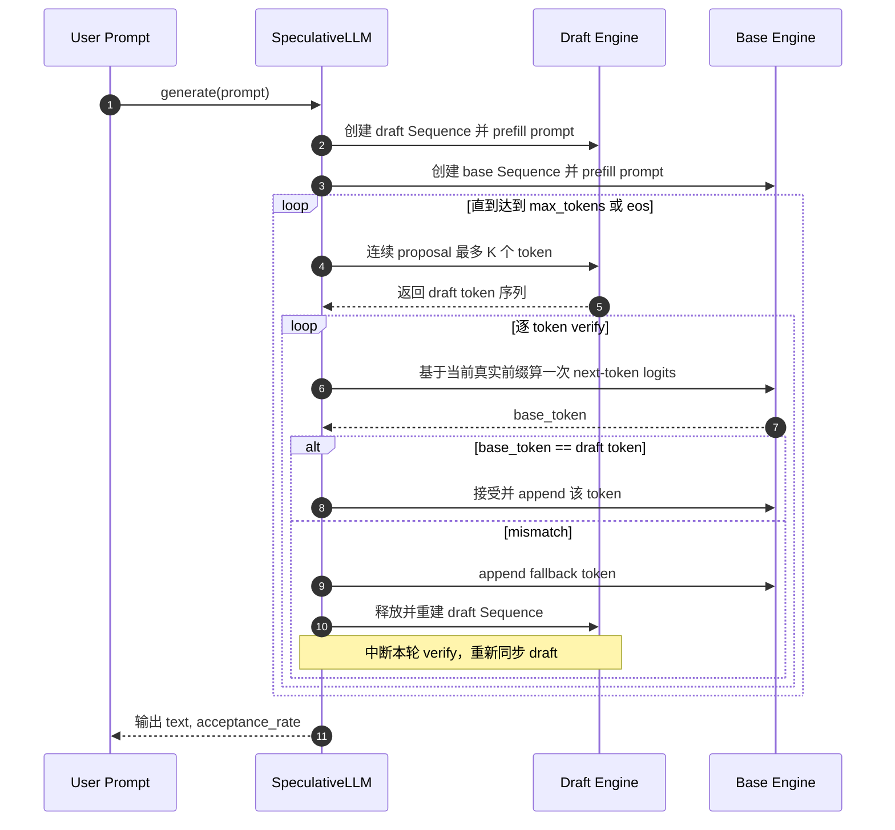
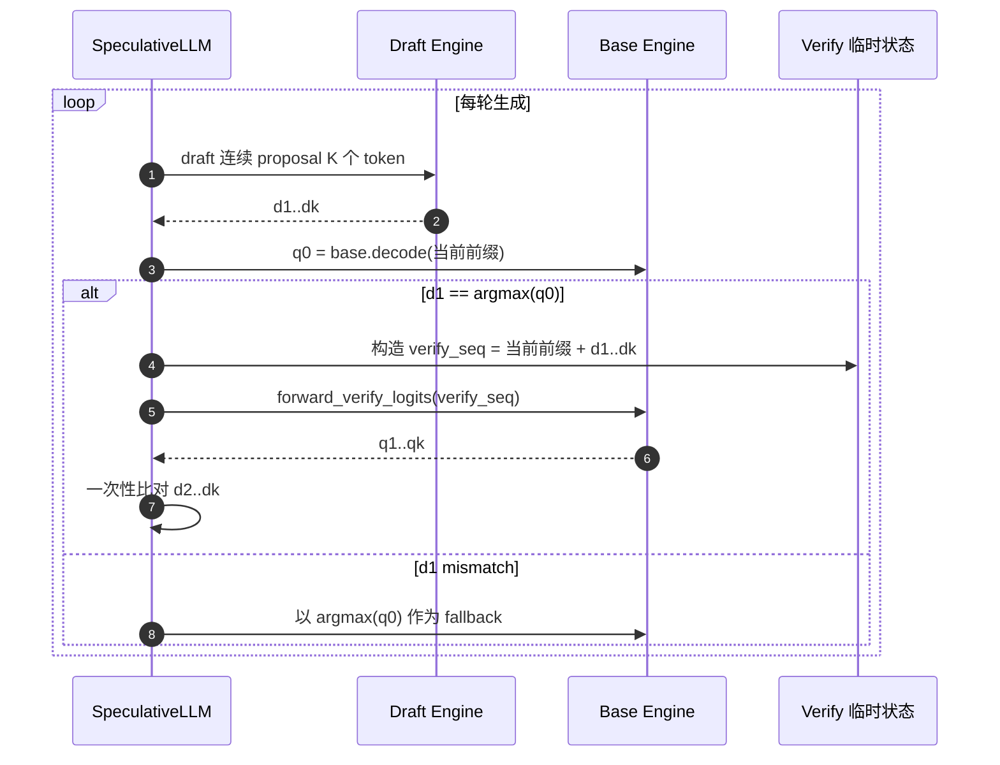
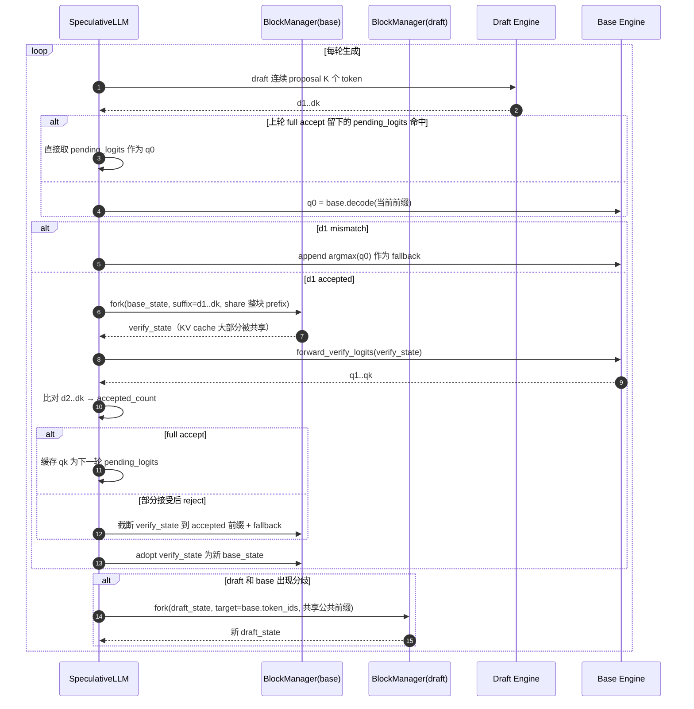
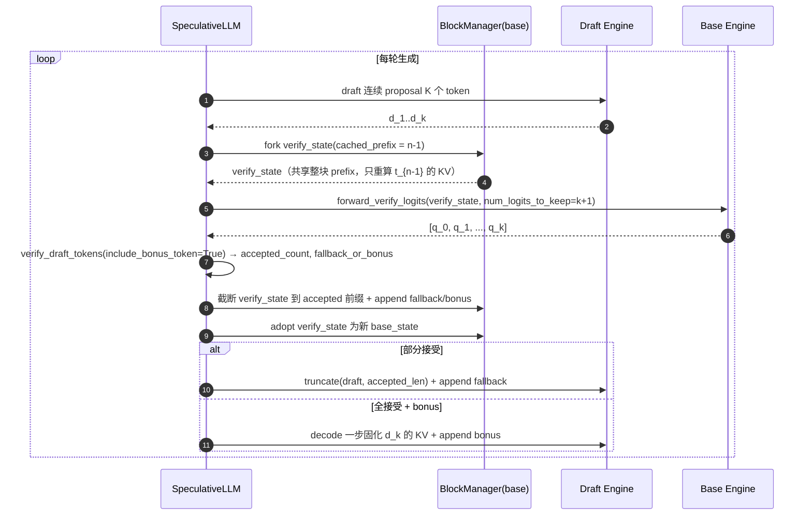

# Speculative Decoding 方案设计

本文档按「版本演进」重新整理了 `nano-vllm` 里 speculative decoding（下文简称 SD）的实现路线，方便后续对比每一版到底解决了什么问题、还剩什么问题。

- 目标：给 `Qwen3-4B`（base）+ `Qwen3-0.6B`（draft）做一套可控、可度量、可渐进优化的 speculative decoding 实现。
- 路线：**保留单模型引擎不动 → 新增 `SpeculativeLLM` → 每个版本只往前推一步，不堆大改**。

## 1. 背景与动机

### 1.1 为什么是 external draft + base，而不是 MTP

- 现有项目结构是单模型 + 单 `LLMEngine` 的经典路线。
- 已经同时下载了 `Qwen3-4B` 和 `Qwen3-0.6B`，非常契合「大模型 + 小草稿」这种经典 SD 配置。
- MTP 需要训练新头，而 external draft 不需要，对这个项目更现实。

### 1.2 项目关键约束

当前生成主循环是单模型思路：

```51:58:nanovllm/engine/llm_engine.py
def step(self):
    seqs, mode = self.scheduler.schedule()
    token_ids = self.model_runner.call("run", seqs, mode)
    if mode == "recompute":
        self.scheduler.postprocess_recompute(seqs)
    else:
        self.scheduler.postprocess_decode(seqs, token_ids)
    outputs = [(seq.seq_id, seq.completion_token_ids) for seq in seqs if seq.is_finished]
```

而且原来的 `Sequence` 只能承担「一个序列对应一个模型」的状态：

```19:35:nanovllm/engine/sequence.py
def __init__(self, token_ids: list[int], sampling_params = SamplingParams()):
    self.seq_id = next(Sequence.counter)
    self.status = SequenceStatus.WAITING
    self.token_ids = copy(token_ids)
    self.last_token = token_ids[-1]
    self.num_tokens = len(self.token_ids)
    self.num_prompt_tokens = len(token_ids)
    self.num_cached_tokens = 0
    self.block_table = []
    self.prefix_block_table = []
    self.pending_recompute_block_ids = []
    self.evicted_prefix_blocks = 0
    self.recompute_pending = False
    self.keep_last_blocks = 0
    self.temperature = sampling_params.temperature
    self.max_tokens = sampling_params.max_tokens
    self.ignore_eos = sampling_params.ignore_eos
```

所以 SD 最大的结构变化不是采样逻辑，而是：**一个用户请求要同时维护 base 和 draft 两套状态**。

### 1.3 总体策略（不变，贯穿所有版本）

- 不改坏 `LLMEngine`，新增 `SpeculativeLLM` 作为上层调度
- 内部持有两个 `LLMEngine`（base / draft），各自管好自己的 KV cache
- 只要求同家族 tokenizer、同 eos、同 vocab size
- 单请求先跑通，然后再考虑 batch / scheduler 融合

## 2. 版本演进全貌

| 版本 | 关键词 | 一句话概括 | 状态 |
| --- | --- | --- | --- |
| V0 | 逐 token verify | MVP，先把闭环跑通 | 已被替代 |
| V1 | q0 + 整段 verify | verify 接口打通，路径正确化 | 已被替代 |
| V2 | 去 replay + adopt verify_state | 削掉最重的 base 额外开销 | 已被替代 |
| V3 | 增量状态复用 | verify / resync 都走增量 fork，partial block 也能复用 | 已被替代 |
| V4.0 | fused q0 + verify | 每轮 base 只做一次 prefill(k+1)，全接受自动吃 bonus | **当前版本** |
| V4.1+ 目标 | 动态 draft_length / 更便宜的 draft 对齐 | 继续压缩 per-round 固定成本 | 规划中 |

后面每一节会按「目标 / 主要改动 / 时序图（可选）/ 性能观察 / 剩余问题」五个维度讲。

## 3. V0：最小闭环（逐 token verify）

### 3.1 目标

先把双模型控制流跑通，验证：

- 单卡能同时装下 4B + 0.6B
- `SpeculativeLLM` 能正确串联两个 `LLMEngine`
- greedy 路径下语义正确

### 3.2 主要改动

- `ModelRunner`
  - 单卡场景不再强制初始化 `torch.distributed` 默认进程组
  - `run()` 拆成 `forward_hidden_state / forward_logits / sample_from_logits`
- `SpeculativeLLM`
  - 每个请求各自维护一条 `base Sequence` 和 `draft Sequence`
  - draft 连续 proposal `K` 个 token
  - base 对这些 proposal **逐 token** 判决
  - mismatch 后直接整轮重建 draft `Sequence`

### 3.3 时序图



### 3.4 限制

- base 前向次数几乎没减少
- 每次 mismatch 都会重建 draft，代价重
- verify 接口能力没真正用上（只是在反复跑 decode）

## 4. V1：q0 + 整段 verify 打通

### 4.1 目标

第一次把 verify 真正改成「**整段 verify**」：base 不再逐 token 决策，而是一次拿到 `q1..qk`。

### 4.2 主要改动

- `Qwen3ForCausalLM.compute_logits()` 新增 `only_last_token` 参数
- `ParallelLMHead.forward()` 同步新增 `only_last_token`
- `ModelRunner` 新增：
  - `forward_verify_logits()`：保留 prefill 全部位置 logits
  - `verify_draft_tokens()`：只做 token 比较，不改外部 `Sequence`
- `SpeculativeLLM._verify_with_base()` 的新形态：
  1. 先跑一次 decode 拿 `q0`，判决 `d1`
  2. 如果 `d1` 接受，再对整段 draft suffix 做一次 verify prefill，拿 `q1..qk`
  3. 用 `q1..q{k-1}` 判决 `d2..dk`

### 4.3 时序图



### 4.4 性能观察

- 能正确跑通，`acceptance_rate` 合理
- 但 base 前向还是很多：`q0` + verify prefill 基本是双段
- 而且这时还有一个隐藏 bug：**accepted token 的 KV 没同步回 `base_state`**
  - 详见附录 A.1

### 4.5 限制

- verify 阶段 `LMHead` 会先对整段 hidden states 投影，再切片 → 容易 OOM（附录 A.2）
- full-accept 情况下 `qk` 没被复用（bonus token 收益没吃）
- 「mismatch 后整轮重建 draft」还没解决

## 5. V2：去掉最重的 base 额外开销

### 5.1 目标

V1 的正确性修好之后，先砍掉最重的那条 base 开销：**`_commit_base_tokens()` 的顺序 replay**。同时顺手把 full-accept 的 bonus token 收益接回来。

### 5.2 主要改动

- 彻底移除 `_commit_base_tokens()`
- `_verify_with_base()` 不再只返回「判决结果」，而是直接产出新的 `base_state`
  - 如果前缀被接受，就**直接接管 `verify_state`**
  - 对未接受尾部：先截断 `verify_state` 到 accepted 前缀，再 append fallback
- full-accept 时，把 verify 阶段的 `qk` 塞进新状态的 `pending_logits`
  - 下一轮 base 的第一次 `q0` 查询直接命中 pending_logits，省一次 base decode
- `forward_verify_logits()` 改成「**先切 hidden states、再算 logits**」，彻底解掉附录 A.2 的 OOM
- 禁用 `RMSNorm / SiluAndMul` 的 `@torch.compile`，规避 dynamo 重编译
- 修复 `attention.py` 在 paged prefill 分支里把当前步 k/v 误传给 FlashAttention 的问题（附录 A.4）

### 5.3 性能观察

- 从 V1 的 `~0.54x` 提到 `~0.62x`
- acceptance rate 基本稳定，说明正确性没退化

### 5.4 限制

- `verify_state` 依然是**整轮重建**：每次都 `_make_sequence(prefix + draft_suffix)`，从头 allocate 一遍 block
- mismatch 时 `draft_state` 还是整轮重建
- base 真正的 `q0 + verify prefill` 双段结构没变

## 6. V3：增量状态复用

### 6.1 目标

把「**状态重建**」这条剩下的结构性开销也砍掉：

- `base → verify_state` 走增量 fork
- `draft → resync` 也走增量 fork
- 最后未满块的 KV 不再「被迫重算」

### 6.2 主要改动

- 新增 `_fork_sequence_from_state(engine, state, target_token_ids, cached_prefix_tokens)`：
  - 共享 source `block_table` 中完全 cached 的整块（`ref_count += 1`）
  - 如果 `cached_prefix_tokens` 落在最后未满块里，就把这段 KV **拷贝**到一个新块
  - 只为真正新增的 suffix 额外分配块
- `_verify_with_base()` 从 `_make_sequence()` 切换到 `_fork_sequence_from_state()`，复用 `base_state.num_cached_tokens`
- draft resync 也不再 `_make_sequence()`，而是：
  - 计算 `common_prefix_length(draft.token_ids, base.token_ids)`
  - 从 draft_state fork 出新 draft_state，最大限度复用 draft 自己的 KV
- `_next_logits()` 在 prefill/decode 后把 `num_cached_tokens` 更新到「精确 token 数」，不再按整块粗估
- `prepare_prefill()` 支持「部分 cached block」：
  - 从 `uncached_start` 开始构造 `slot_mapping`
  - 对最后未满 cached block，只写未缓存的那段
  - 这样 verify prefill 不会重复计算前面已经命中的 token

### 6.3 时序图



### 6.4 性能观察

典型一次基准（`draft_length=2`、`max_tokens=128`、`temperature=1e-5`、`<think>` 风格 prompt）：

- baseline 4B：`~19.9 tok/s`
- speculative：`~13.3 tok/s`
- `accepted_tokens = 88`
- `proposed_tokens = 150`
- `acceptance_rate ≈ 0.59`
- `resync_count = 40`
- `speedup_vs_baseline ≈ 0.67x`

用这些数字反推一下：

- 一共 ~75 轮 proposal
- 全接受轮 ~35 轮，贡献 70 accepted token
- 其中 `d1 过了但 d2 没过` 的轮次 ~18 轮
- `d1 就没过` 的轮次 ~22 轮
- base 4B 的实际前向次数大约 `q0 + verify ≈ 90+ 次`，而 baseline 是 128 次

也就是说，**base 前向次数确实降了，但降得还不够狠**，这是 V3 的真实瓶颈。

### 6.5 剩余问题

- V3 削掉的主要是「状态管理的固定成本」，不是「base 计算复杂度」
- `q0` 和 verify prefill 还是两段，大量轮次都要跑两次 base
- partial cached block 会触发一次「KV 块拷贝」，比重算便宜，但不是零成本
- 当前 benchmark 的 `<think>` prompt 对 draft 非常不友好，会放大上面的问题

## 7. V4.0：fused q0 + verify（当前版本）

### 7.1 目标

V3 的瓶颈是**每轮 base 还要跑两次前向**（`decode` 拿 `q0` + `prefill(k)` 拿 `q1..qk`）。
V4.0 的目标是把它们合并成**一次** `prefill(k+1)`，并顺手吃到 `bonus token`。

### 7.2 核心洞察

`q0..qk` 是同一个 causal attention 下连续 `k+1` 个 query 位置的输出：

- query at pos `n-1` → 基于 `t_0..t_{n-1}` 预测，即 `q_0`
- query at pos `n` → 基于 `t_0..t_{n-1}, d_1` 预测，即 `q_1`
- ...
- query at pos `n+k-1` → 基于 `t_0..t_{n-1}, d_1..d_k` 预测，即 `q_k`

这些 query 完全可以一次 FlashAttention 前向拿到。区别只是 verify_state 的 query 长度从 `k` 涨到 `k+1`，多出来的那个 query 位置 `n-1` 对应的 token 是 `t_{n-1}`，它的 K/V 需要被重算并写入 verify_state 的新 block（等价于原 K/V，只是多算 1 个 token 的 attention）。

### 7.3 主要改动

- `_verify_with_base()` 重写为 fused 版本：
  - fork verify_state 时 `cached_prefix_tokens = base.num_cached_tokens - 1`
  - 一次 `forward_verify_logits(num_logits_to_keep=k+1)` 拿 `[q_0..q_k]`
  - `verify_draft_tokens(..., include_bonus_token=True)` 做一次性比对
    - 部分接受 → `fallback_token_id = argmax(q_{accepted})`
    - 全部接受 → `fallback_token_id = argmax(q_k)` 即 bonus
- `_adopt_base_verify_state()` 简化：
  - 不再接收 `bonus_logits`
  - `fallback_token_id is not None` 统一 append 到 verify_state（fallback 和 bonus 语义合并）
- `_SequenceState.pending_logits` 字段和 `_next_logits()` 里对应的分支**整条删除**（V4 下每轮都靠 fused verify 生成下一轮的 last_token，不再需要跨轮缓存 logits）
- `_generate_one()` 里的 draft 对齐改走更便宜的 `truncate + append`：
  - **Case A/B（部分接受）**：截断 draft 到 accepted 长度（顺带丢弃 `d_k` 的未算 KV），再 append fallback
  - **Case C（全接受 + bonus）**：先让 draft 做一次 decode 固化 `d_k` 的 KV（logits 丢弃），再 append bonus
  - 这样 draft 维持「末尾 1 token KV 未算」的稳态不变量

### 7.4 时序图



### 7.5 每轮 base 成本对比

| 场景 | V3 的 base 成本 | V4.0 的 base 成本 | 备注 |
|---|---|---|---|
| A: `d_1` miss | 1 × decode(1) | 1 × prefill(k+1) | 多算 k 个 token（主要的亏点） |
| B: 部分接受 | 1 × decode(1) + 1 × prefill(k) | 1 × prefill(k+1) | 少一次 launch |
| C: 全接受 | 1 × decode(1) + 1 × prefill(k) | 1 × prefill(k+1)，顺手拿 bonus | 少一次 launch + 多接 1 个 token |

每轮 base forward 永远只有一次调用，CUDA launch 次数显著减少。

### 7.6 实测结果（k=2, `<think>` 长推理 prompt, enforce_eager=True）

| 指标 | V3 | V4.0 | 变化 |
|---|---|---|---|
| baseline 4B | 19.9 tok/s | 21.5 tok/s | 基线略有波动 |
| speculative | 13.31 tok/s | **16.54 tok/s** | +24% |
| `speedup_vs_baseline` | 0.668x | **0.771x** | +0.10 |
| `accepted_tokens` / `proposed_tokens` | 88 / 150 | 71 / 115 | 轮数减少 |
| `acceptance_rate` | 0.587 | 0.617 | 基本持平 ✅ |
| `resync_count`（只记部分接受） | 40 | 28 | -30% |
| `generated_tokens` | 128 | **129** | bonus token 真的被接受了 ✅ |

从 `(accepted=71, proposed=115, resync=28, generated=129)` 反推轮次分布：

- 总轮数 R = 129 - 71 ≈ 58 轮（V3 是 75 轮，**直接少 17 轮 base prefill**）
- 按 `{X=全接受+bonus, Y=部分接受, Z=零接受}` 解方程 → X=30, Y=11, Z=17
- 30 轮全接受每轮产出 3 个 token（d_1, d_2, bonus），是 V4 相对 V3 多出来的主要增益来源

### 7.7 剩余 overhead 的来源分析

baseline 47ms/tok，V4.0 实测 60ms/tok，平均每轮 ~134ms 产 2.22 个 token。相对 baseline 的等量输出多花 ~30ms/轮：

| 来源 | 估计耗时 / 轮 |
|---|---|
| draft 2 次 decode (0.6B) | ~10ms |
| Case C 下多跑的那次 dummy decode（52% 命中率） | ~3ms |
| verify_state fork（含 partial block KV 拷贝） | ~3-5ms |
| Python 控制流 + `.tolist()` + tensor 准备 | ~10ms |
| base `prefill(k+1)` vs baseline `decode(1)` 的单次差 | ~5ms |
| 合计 | ~30ms ✅ |

没有隐藏退化，剩余的都是「小批量前向 + Python 开销 + draft cost」构成的结构性天花板。

### 7.8 V4.0 的遗留问题 & 未来方向（V4.1+）

按预期收益从大到小：

1. **消灭 Case C 下 draft 的 dummy decode**（最干净，估计还能拿 2-3%）
   - 改法：让 `_next_logits` 支持「多 token 未缓存」→ 走 prefix-cache prefill 一次补算 `[d_k, bonus]`，并返回最后位置的 logits 作为下一轮起点
   - 本质是给 decode 路径加一条「multi-uncached tokens fallback to prefix-cache prefill」的分支
2. **`draft_length` 动态调节**（试 k=3）
   - 当前 acceptance rate 0.617、full-accept 占 52%，有空间往 k=3 试
   - 简单策略：连续 2 轮 full-accept → k+=1（上限 4），连续 2 轮 零接受 → k-=1（下限 1）
   - k=3 在 draft 友好段落里能拿更多 bonus 机会
3. **减 Python / CPU-GPU 同步**（低收益但安全）
   - `verify_draft_tokens` 里 `.tolist()` 强制 CPU 同步，可以改成 tensor 比较后只在拒绝时 `.item()`
   - fork 里的 Python 循环也可以预编译
4. **CUDA Graph for fused verify**（复杂度最高）
   - 当前 `enforce_eager=True`
   - 每轮 `prefill(k+1)` 形状固定，理论上可 graph，但 `block_tables` 动态导致困难，放到更后面再碰
5. **benchmark 扩展**
   - `<think>` 长推理是最坏情况
   - 建议后续用多组 prompt（短回答 / 模板化 / 长推理）跑一批分布
6. **采样路径支持（temperature > 0）**
   - V4.0 的 bonus token 目前只在 greedy 语义下合法
   - 采样版 SD（拒绝采样）需要在 `verify_draft_tokens` 上再加一层

## 附录 A：已解决的历史问题

### A.1 accepted draft token 没同步回 `base_state` 的 KV cache

- 现象：V1 改成整段 verify 后，输出开始出现重复符号 / 乱码，`token_ids` 看起来推进了但 next token 不合理
- 根因：accepted token 只追加回了 `base_state.seq.token_ids`，但对应 K/V 没写回 base 自己的 cache
- 修复：V2 里 `_verify_with_base()` 直接接管 `verify_state`；KV 不再需要手动 replay

### A.2 `forward_verify_logits()` 的 vocab projection OOM

- 现象：在 `embed_head.py` 的 `F.linear(x, self.weight)` 处 OOM
- 根因：先算整段 hidden→logits，再切 `[-K:]`，显存大头早就花掉了
- 修复：V2 改成**先切 hidden states、再算 logits**，把 vocab projection 的计算量限制到 K 个位置

### A.3 `RMSNorm / SiluAndMul` 的 `@torch.compile` 重编译

- 现象：dynamo 反复重编译、`rank mismatch. expected 3, actual 2` 告警、甚至 autotune 自身 OOM
- 根因：speculative 路径下频繁出现不同 shape，`@torch.compile` 在 eager + 小步 decode 下表现很差
- 修复：V2 起直接去掉这两个热点函数的 `@torch.compile`，并让 `run_test.py` 走 `enforce_eager=True`

### A.4 attention paged prefill 误传当前步 k/v

- 现象：`RuntimeError: Paged KV cache block size must be divisible by 256`，只有 draft resync 频繁时才触发
- 根因：带 `block_table` 的 prefill 应该读 paged `k_cache/v_cache`，但代码把当前步的连续 `k/v` 直接传给了 FlashAttention
- 修复：V2 在 `attention.py` 里区分「prefix-cache prefill」和「首次 prefill」两条路径

### A.5 `atexit` 双重清理

- 现象：程序退出时 `AttributeError: 'LLMEngine' object has no attribute 'model_runner'`
- 根因：手动 `exit()` 之后 `atexit` 还会再跑一次
- 修复：`LLMEngine.exit()` 和 `SpeculativeLLM.exit()` 都加 `_closed` 幂等标记

## 附录 B：验证指标清单

每次改动都至少记录：

- `acceptance_rate`
- `accepted_tokens`
- `proposed_tokens`
- `resync_count`
- 端到端 `tokens/s`（baseline vs speculative）
- `speedup_vs_baseline`
- 显存峰值（结合 `[KV Alloc Debug]` 和 `nvidia-smi`）

经验上：

- acceptance rate 长期 `<30%`：这个 draft/base 组合在当前 prompt 上基本不划算
- acceptance rate 在 `60%-80%`：很值得继续往下优化
- V3 当前 `~0.59` 属于中间地带，瓶颈主要在「base 前向次数还没真正降下来」

## 附录 C：当前仍然存在的限制

- `SpeculativeLLM` 还是串行处理请求，没有 batch SD
- 还没有和原生 `Scheduler` 融合
- 还没把 draft / base 的状态抽成独立 `ModelCacheState`
- `draft_length` 只支持固定值，没做按 acceptance rate 自适应

## 附录 D：下一步计划

按收益从大到小排：

1. 把 V4 的「融合 `q0 + verify`」原型做出来，这是目前最直接能拉 tok/s 的改动
2. 在 greedy 路径下补 bonus token 的真正接受
3. 把 benchmark 换成多组 prompt（短回答 / 模板化任务 / 长推理）跑一轮，得到一个更客观的 speedup 分布
4. 在 V4 验证有收益之后，再考虑：
   - batch SD
   - 和 `Scheduler` 融合
   - `ModelCacheState` 抽象
