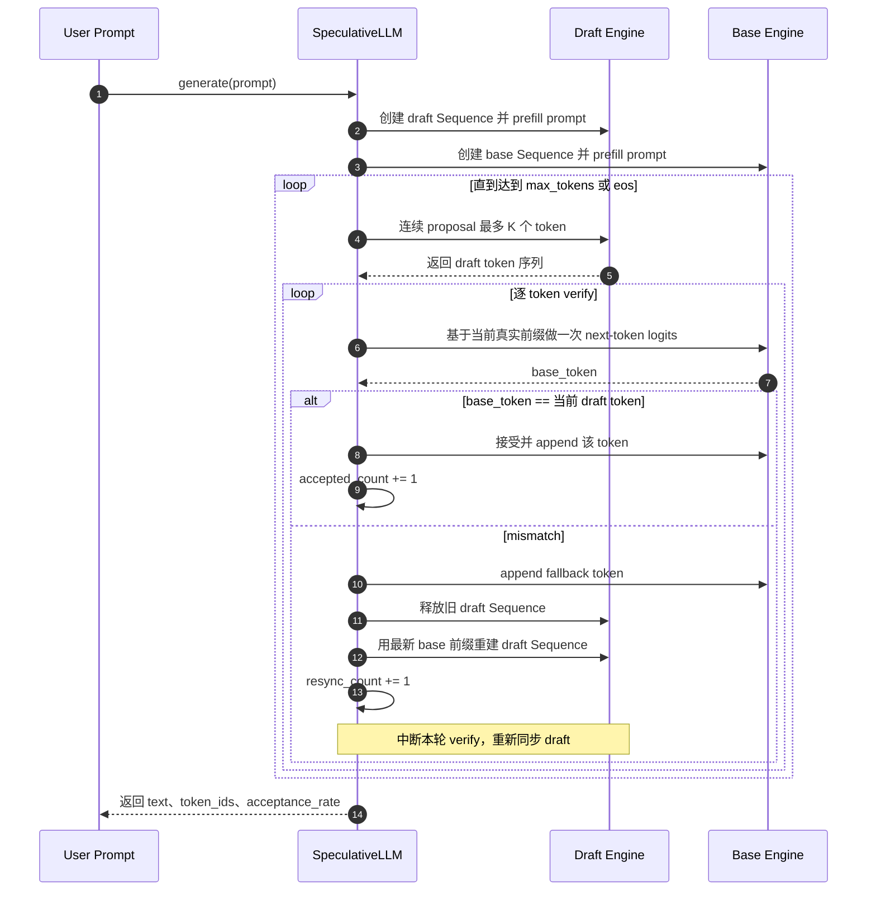
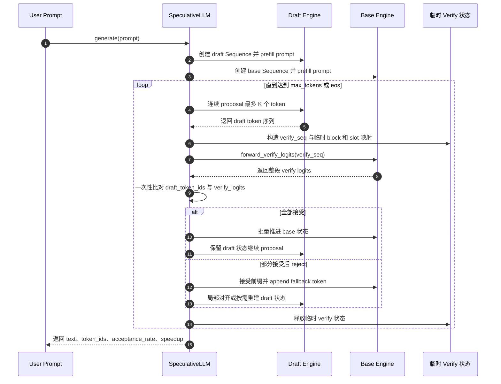

可以，而且我建议你先做的是 **“外部 draft model 的 speculative decoding”**，也就是：

- `Qwen3-4B` 作为 `base/target model`
- `Qwen3-0.6B` 作为 `draft model`

这条路线比“先做 MTP head”更适合你现在这个项目，因为它更贴合你已经有的两个完整模型。

## 先说结论

如果按你这个 `nano-vllm` 当前结构，我建议分 **3 个阶段** 做：

1. 先做一个 **最小可运行版**
   - 单请求
   - 不做 batching
   - 不做 prefix eviction/recompute
   - 先跑通 `draft propose -> base verify -> accept/reject`
2. 再做 **工程化版本**
   - 支持多请求 batch
   - 支持现有 `Scheduler`
   - 支持双模型各自 KV cache
3. 最后再做 **性能版**
   - 减少 Python 循环
   - 减少临时张量
   - 做统计与 benchmark

我不建议一上来就把 speculative decoding 深度揉进现在的 `Scheduler` 主循环，不然改动面会很大，容易把单模型路径也搞乱。

## 你现在这个项目的关键约束

当前生成主循环是单模型思路，`step()` 一次只调度一套 `Scheduler + ModelRunner`：

```51:58:nanovllm/engine/llm_engine.py
def step(self):
    seqs, mode = self.scheduler.schedule()
    token_ids = self.model_runner.call("run", seqs, mode)
    if mode == "recompute":
        self.scheduler.postprocess_recompute(seqs)
    else:
        self.scheduler.postprocess_decode(seqs, token_ids)
    outputs = [(seq.seq_id, seq.completion_token_ids) for seq in seqs if seq.is_finished]
```

而 `Sequence` 里现在只存了一套 cache 相关状态，也就是默认“一个序列对应一个模型的 KV 状态”：

```19:35:nanovllm/engine/sequence.py
def __init__(self, token_ids: list[int], sampling_params = SamplingParams()):
    self.seq_id = next(Sequence.counter)
    self.status = SequenceStatus.WAITING
    self.token_ids = copy(token_ids)
    self.last_token = token_ids[-1]
    self.num_tokens = len(self.token_ids)
    self.num_prompt_tokens = len(token_ids)
    self.num_cached_tokens = 0
    self.block_table = []
    self.prefix_block_table = []
    self.pending_recompute_block_ids = []
    self.evicted_prefix_blocks = 0
    self.recompute_pending = False
    self.keep_last_blocks = 0
    self.temperature = sampling_params.temperature
    self.max_tokens = sampling_params.max_tokens
    self.ignore_eos = sampling_params.ignore_eos
```

所以如果你要做 speculative decoding，**最大的结构变化不是采样逻辑，而是“一个用户请求要同时维护 base 和 draft 两套状态”**。

## 我建议的总体方案

### 方案核心

新增一个独立的 `SpeculativeEngine`，而不是直接改坏 `LLMEngine`。

它内部拥有：

- 一个 `base_runner`
- 一个 `draft_runner`
- 一个统一 tokenizer
- 一套新的 request state

不要先复用现在完整的两个 `LLMEngine`，因为：
- `LLMEngine` 自带各自 `Scheduler`
- 你不需要两个独立调度器互相打架
- 你真正需要的是“两个模型执行器 + 一套共享的请求状态机”

### 新增的数据结构

建议新增：

- `SpeculativeRequest`
- `ModelCacheState`

`SpeculativeRequest` 里放：
- `request_id`
- `token_ids`
- `prompt_len`
- `finished`
- `sampling_params`
- `base_state`
- `draft_state`

`ModelCacheState` 里放：
- `num_cached_tokens`
- `block_table`
- `prefix_block_table`
- `pending_recompute_block_ids`
- `evicted_prefix_blocks`
- `recompute_pending`

也就是说，别再让一个 `Sequence` 同时承担“用户语义状态 + 某个模型的 cache 状态”两件事。

## 最小可运行版怎么做

### 第一步：先补底层能力

你至少要先做这几个基础改动：

- `ModelRunner` 在 `tensor_parallel_size == 1` 时不要初始化 `dist.init_process_group`
- 给 `ModelRunner` 新增一个“只跑前向、返回 logits 或 hidden_states”的接口
- 给 `ModelRunner` 新增一个“验证 draft token 序列”的接口

原因是当前 `run()` 更像“跑完直接 sample 一个 token”，不适合 verify 多个草稿 token。

## speculative decoding 的最小闭环

对单个请求，流程是这样：

1. **base prefill prompt**
   - 把原始 prompt 跑进 base，建立 base KV
2. **draft prefill prompt**
   - 把同一个 prompt 跑进 draft，建立 draft KV
3. 进入循环，直到结束

每轮循环：

1. draft 连续提议 `K` 个 token
   - 比如 `K=4`
   - draft 自己一 token 一 token decode，得到 `d1 d2 d3 d4`
2. base 一次性验证这 `K` 个 token
   - 用 base 对“当前前缀 + 提议 token”做一次 verify
   - 拿到每个位置 base 真正偏好的 next token
3. 从前往后比较
   - 如果 `d1` 匹配，就接受
   - 再看 `d2`
   - 直到第一个不匹配的位置
4. 更新状态
   - 接受的 token 追加到最终输出
   - 同步推进 base cache
   - draft 如果完全匹配就继续往前走
   - 如果中间拒绝，则把 base 在拒绝点采出来的 token 作为真实输出，并让 draft 从这个新前缀重新对齐

## verify 阶段要怎么落在你这套代码里

这里是实现重点。

### 做法 A：新增 `verify_tokens()` 接口
我最推荐这个。

在 `ModelRunner` 里新增类似：

- `verify_tokens(seq, proposed_token_ids) -> VerifyResult`

返回：
- `accepted_count`
- `accepted_token_ids`
- `fallback_token_id`
- 可选的 `base_logits`

这样上层 `SpeculativeEngine` 不需要关心太多底层细节。

### 做法 B：复用 `prefill` 路径但返回逐位置 logits
也能做，但会牵扯更多现有接口。

因为 verify 的本质是：
- base 对一段新 token suffix 跑 forward
- 你需要这段 suffix 每个位置对应的 logits
- 再拿这些 logits 和 draft proposals 逐个比对

如果你现在 `run()` 只是最后 sample 一个 token，那就不够用，必须把“逐位置 logits”暴露出来。

## 需要改哪些模块

### `nanovllm/engine/model_runner.py`
重点改这里。

要做：
- 单卡时跳过 `dist.init_process_group`
- 拆分 `run()` 为更细的执行接口
- 新增 `verify_tokens()`
- 新增“append 已接受 token 到 cache”的能力

### `nanovllm/engine/sequence.py`
不要硬往当前 `Sequence` 里再塞第二套字段。  
更建议新增一个专门给 speculative 用的新状态类。

### `nanovllm/engine/block_manager.py`
第一版尽量少动。
先只复用它的基础 block 分配/append 逻辑，不马上碰复杂的 prefix eviction/recompute。

### `nanovllm/engine/llm_engine.py`
不要直接大改。  
保留单模型路径不动，另外新增：

- `nanovllm/speculative/speculative_engine.py`

### `nanovllm/llm.py`
可以额外导出一个新入口，比如：
- `SpeculativeLLM`

## 我建议的分阶段落地

### Phase 0：基础重构
目标：让一个进程里能安全持有两个模型执行器。

要做：
- 修单卡重复初始化 `dist` 的问题
- 把“采样一个 token”和“返回 logits”分开
- 把模型执行器从 `LLMEngine` 里稍微解耦

### Phase 1：MVP
目标：单请求 speculative decode 跑通。

限制：
- 只支持 batch size = 1
- 只支持 greedy 或 very low temperature
- 不支持 prefix eviction/recompute
- draft step 数固定 `K=4`

这版主要是验证：
- 逻辑正确
- 显存可承受
- acceptance rate 大概多少

### Phase 2：支持 batch
目标：多个请求并行 speculative decode。

这时才需要考虑：
- 每个请求 accepted count 不同
- 某些请求 reject，某些 accept all
- batch 内请求长度不同
- base/draft 的 block table 如何分别推进

### Phase 3：接入现有调度
目标：让 speculative 成为正式推理模式，而不是 demo。

这时再考虑：
- 和 `Scheduler` 结合
- eviction/recompute 如何对 base 和 draft 分别处理
- throughput benchmark

## 第一版我建议你故意“做简陋一点”

为了最快验证可行性，第一版请主动限制范围：

- 只支持 `Qwen3-4B + Qwen3-0.6B`
- 只支持同 tokenizer、同模型家族
- 只支持 `temperature=1e-5` 近似 greedy
- 只支持单条请求
- 只支持 `max_model_len <= 2048`
- 先不启用复杂 preemption

这样你几天内就能知道这条路值不值得继续。

## 验证指标要看什么

不要只看“能不能跑”。

至少记录：

- `acceptance_rate`
- `draft_tokens_per_step`
- `base_verified_tokens_per_step`
- 端到端 `tokens/s`
- 单模型 `4B` 基线速度
- speculative 后速度提升比
- 显存峰值

如果 acceptance rate 很低，比如长期只有 `30%` 左右，那这条配置大概率不划算。  
如果能到 `60%-80%`，就很值得继续。

## 我对你这个项目的具体建议

如果是我来落地，我会这么排顺序：

1. 先修 `ModelRunner` 单卡双实例问题
2. 把 `run()` 拆成“前向”和“采样”两个层次
3. 新增 `SpeculativeEngine`
4. 先做单请求、固定 `K=4` 的 MVP
5. 先不碰现有 `Scheduler` 的复杂逻辑
6. 跑通后再决定是否把它并入主引擎

## 一句话判断

**最合适的实现路线不是“在现有 `LLMEngine` 上直接打补丁”，而是“保留单模型引擎不动，新增一个专门的 `SpeculativeEngine`，先做单请求 MVP，再逐步接入调度器”。**

如果你愿意，下一步我可以继续给你一份更具体的东西：  
**按文件拆解的开发清单**，比如先改哪个文件、加哪些类、每个接口签名大概长什么样。

## 当前已落地的 MVP 细节

下面这部分是当前代码里已经实现的内容，和上面偏方案设计的部分区分开。

### 1. `ModelRunner` 已经完成的基础重构

- 单卡场景下不再强制初始化 `torch.distributed` 默认进程组。
- `run()` 已拆成三层：
  - `forward_hidden_state()`
  - `forward_logits()`
  - `sample_from_logits()`
- 新增了 `forward_verify_logits()`：
  - 作用是保留 prefill 全部位置的 logits
  - 通过 `compute_logits(..., only_last_token=False)` 绕过原先“prefill 只保留最后一个位置”的优化
- 新增了 `verify_draft_tokens()`：
  - 只负责把 draft proposal 和 verify logits 做比对
  - 不直接修改外部 `Sequence`

### 2. `LMHead` 与 `compute_logits` 的改动

- `ParallelLMHead.forward()` 新增了 `only_last_token` 参数。
- `Qwen3ForCausalLM.compute_logits()` 新增了 `only_last_token` 参数并向下透传。
- 普通单模型生成仍然走默认逻辑：
  - `only_last_token=True`
- verify 路径可以显式关闭这个优化：
  - `only_last_token=False`

### 3. 当前 `SpeculativeLLM` 的实现策略

当前已经新增了一个最小版 `SpeculativeLLM`，但它有意保持保守：

- 单请求
- 不做 batch speculative decode
- 只支持 greedy proposal / greedy verify
- mismatch 后直接重建 draft 序列
- 先保证逻辑闭环可运行，不先追求吞吐提升

它内部的真实策略是：

1. base / draft 各自维护一条 `Sequence`
2. draft 先连续提议 `K` 个 token
3. base 按 token 逐个验证这些 proposal
4. 如果中途 reject：
   - base 追加自己的 fallback token
   - draft 直接按最新真实前缀重建
5. 如果全部 accept：
   - 继续沿用当前 draft 状态，不重建

### 3.1 当前 MVP 与未来高性能版时序图对比

下面两张图分别描述：

- 当前已经落地的 MVP：`draft proposal + base 逐 token verify + reject 后重建 draft`
- 未来目标版本：`draft proposal + base 整段 verify + 尽量避免重建 draft`

#### 当前 MVP 时序图

这张图对应现在代码里的真实控制流。  
最大特点是：**base 还是逐 token verify**，而且 **reject 后会直接重建 draft 状态**。



#### 未来高性能版（整段 verify）时序图

这张图描述的是后续希望演进到的版本。  
核心变化是：**draft 先提一整段，base 一次性返回整段 verify logits**，从而减少 Python 循环和多次 decode 调用。



### 4. 为什么当前版本没有直接用“整段 verify 加速”

因为要做真正高效的一次性 verify，还要解决两个工程问题：

- `verify_seq` 的临时 block / slot 分配
- partial block 场景下的 suffix 对齐

这两件事在当前 `BlockManager + Sequence` 结构里都不是一句“多跑一次 prefill”能安全解决的。  
所以当前 MVP 先选择：

- 保证语义正确
- 把 verify 的 logits 通路打通
- 把双模型控制流跑通

后面再把 base 的逐 token verify 替换成真正的一次性 verify。

## 当前版本的限制

这版实现目前明确有这些限制：

- 主要是“逻辑 MVP”，不是性能 MVP
- 真正的 speculative speedup 还没完全体现出来
- `SpeculativeLLM.generate()` 当前按请求串行处理
- 默认按 greedy 路径工作，更适合 `temperature` 非常低的实验
- 还没有和原有 `Scheduler` 主循环深度融合
- 还没有把 draft / base 的状态抽象成独立 `ModelCacheState`

## 当前版本的问题分析

下面这部分不是泛泛而谈，而是结合当前测试结果做的针对性分析。  
例如在一次基线对比中：

- baseline: `14.526 tok/s`
- speculative: `7.386 tok/s`
- `speedup_vs_baseline = 0.509x`
- `accepted_tokens = 89`
- `proposed_tokens = 208`
- `acceptance_rate = 0.428`
- `resync_count = 38`

这些数字说明：当前 speculative decoding 不是“稍微没调好”，而是**在实现层面还没有真正打到 speculative decoding 的核心收益点**。

### 1. base 的调用次数几乎没有真正降下来

当前实现里，draft 虽然一次会 proposal 多个 token，但 base 不是“一次性整段 verify”，而是对 draft 的每个 token 都重新做一次 next-token 判断。

这意味着：

- baseline 生成 `128` 个 token，大致就是 `128` 次 base next-token 决策
- 当前 speculative 版本里，base 仍然做了接近这个数量级的决策
- 只是额外又叠加了一层 draft 的 proposal 成本

换句话说，**当前版本没有把“大模型调用次数减少”这个 speculative decoding 最核心的收益真正兑现出来。**

### 2. draft 带来的额外工作量远大于它节省下来的工作量

当前一次测试里：

- `proposed_tokens = 208`
- `accepted_tokens = 89`
- `acceptance_rate = 0.428`

这说明：

- draft 提出了很多 token
- 但真正被 base 接受的比例并不高
- 大量 proposal 最后都变成了额外计算

当 acceptance rate 只有 `42.8%` 左右时，draft 这部分工作很容易从“加速器”变成“额外负担”。

### 3. reject 路径太重，频繁重建 draft 状态

当前实现一旦出现 mismatch，就会：

- 释放旧 draft `Sequence`
- 用最新 base 前缀重建 draft `Sequence`
- draft 再重新 prefill / 恢复状态

而测试里：

- `resync_count = 38`

这说明这种“释放 + 重建”的昂贵路径被触发了很多次。  
它会直接带来：

- 更多 block 管理开销
- 更多前缀重建成本
- 更多 Python 侧控制流开销

这也是当前吞吐明显下滑的重要原因。

### 4. 当前 `ModelRunner` 的 verify 接口虽然已经铺好，但上层还没真正用起来

底层已经有：

- `forward_verify_logits()`
- `verify_draft_tokens()`

也就是说，“一次性整段 verify” 所需的底层接口已经开始具备雏形。  
但当前 `SpeculativeLLM` 上层逻辑仍然走的是：

- draft 连续 proposal
- base 逐 token verify

所以现在的问题不是“完全没有 verify 能力”，而是**上层调度逻辑还没有切换到真正的整段 verify 路径**。

### 5. 没有利用 full-accept 时的 bonus token

标准 speculative decoding 通常在“整段 draft token 全部被接受”时，还会顺手拿到一个额外的 bonus token。  
这个 bonus token 很重要，因为它是把 verify 成本进一步摊薄的关键收益之一。

而当前版本里，这部分收益还没有真正落到上层控制流里。  
因此即使整段 accept，也没有把 speculative decoding 的收益吃满。

### 6. `torch.compile` 的重编译在放大小步推理的额外开销

实际运行中已经看到类似告警：

- `torch._dynamo hit config.recompile_limit`
- `rms_forward`
- `tensor 'x' rank mismatch. expected 3, actual 2`

这说明 `RMSNorm` 这类被 `@torch.compile` 包裹的函数，在当前 speculative 路径下反复遇到不同形状输入。  
这不会直接让程序错误，但会：

- 带来额外重编译开销
- 放大小步 decode / verify 场景下的性能损失

这部分不是当前负优化的唯一原因，但确实在进一步恶化现状。

### 7. 当前测试 prompt 也偏“难例”

当前 benchmark prompt 会触发较长的思维链输出（例如 `<think>` 风格内容），这类输出通常：

- token 更长
- 推理链更复杂
- draft 和 base 更容易分歧

因此它会把当前实现中的这些问题进一步放大：

- acceptance rate 偏低
- resync 更频繁
- 总体 proposal 浪费更严重

所以当前 benchmark 结果既反映了实现问题，也反映了测试样例本身偏难。

## 一句话归纳

当前版本的根本问题不是“draft model 完全不可用”，而是：

**当前实现仍然停留在“逻辑闭环版 speculative decoding”，还没有真正进入“减少 base 调用次数、降低 reject 成本、批量 verify”的性能版 speculative decoding。**

## 当前已定位的 correctness 与 OOM 问题

在进一步优化性能之前，当前版本还有两个已经明确定位出来的关键问题需要单独记录：

### 1. accepted draft token 没有正确同步回 `base_state` 的 KV cache

这是一个**正确性问题**，优先级非常高。

#### 现象

在把 `_verify_with_base()` 从“纯逐 token verify”改成“`q0 + 整段 verify`”之后，曾经出现过：

- 输出文本明显异常
- 出现大段重复符号或乱码式内容
- `base_state.seq.token_ids` 看起来已经包含了被接受的 draft token
- 但下一轮 decode 的 next token 明显不符合预期

#### 根因

问题不在于 prompt token 没有传进去，而在于：

- `verify_state` 用来跑整段 verify
- verify 完后只把 accepted token 追加回 `base_state.seq.token_ids`
- 但这些 accepted token 对应的 K/V **并没有真正写回 `base_state` 自己的 cache**

于是状态变成：

- `token_ids` 看起来已经推进了
- 但 `base_state` 底层的 KV cache 仍然停留在旧前缀

后续 decode 就会在“token 序列”和“KV cache”不一致的情况下继续运行，最终导致输出错误。

#### 当前处理方式

当前已经把逻辑改成：

- `_verify_with_base()` 只负责**判决**
- 真正的 token 提交交给 `_commit_base_tokens()`
- `_commit_base_tokens()` 会通过顺序 replay 的方式，把 accepted / fallback token 真正同步回 `base_state`

这个版本的核心目的不是提速，而是先保证：

- `base_state.seq.token_ids`
- `base_state` 自己的 KV cache

在语义上重新一致。

#### 当前状态

- 这个 correctness 问题已经有了初步修复思路
- 但当前 `_commit_base_tokens()` 仍然是顺序 replay，成本较高
- 后续仍然需要更高效的“批量提交 accepted token”方案

### 2. `forward_verify_logits()` 先算整段全量 logits，导致 verify 阶段显存暴涨

这是一个**OOM 问题**，也是当前整段 verify 路径里最典型的内存瓶颈。

#### 现象

实际运行中，曾出现类似错误：

- `torch.OutOfMemoryError`
- 错误点落在：
  - `embed_head.py`
  - `F.linear(x, self.weight)`
  - `compute_logits(..., only_last_token=False)`
  - `forward_verify_logits()`

并且从堆栈看，OOM 并不是发生在 hidden states 阶段，而是发生在：

- 把 hidden states 投影到整个 vocab logits 的那一步

#### 根因

旧版本的 `forward_verify_logits()` 逻辑是：

1. 先对 verify suffix 得到完整 hidden states
2. 再对完整 hidden states 做整段 `LM Head` 投影
3. 最后才对 logits 做 `[-K:]` 切片

问题在于：

- 显存大头发生在 `hidden_states -> logits`
- 等到最后切片时，显存已经花出去了

所以这种写法本质上还是在算：

- “整段未缓存 suffix 的全量 logits”

而不是只算 verify 真正需要的那 `K` 个位置。

#### 当前处理方式

当前已经把 `forward_verify_logits()` 改成：

- 先截取最后 `num_logits_to_keep` 个 hidden states
- 再只对这部分 hidden states 做 `compute_logits(..., only_last_token=False)`

也就是从：

- `整段 hidden_states -> 整段 logits -> 切片`

改成：

- `整段 hidden_states -> 先切 hidden states -> 只算最后 K 个 logits`

这一步可以显著降低 verify 阶段的 vocab projection 显存占用。

#### 当前状态

- 这个 OOM 根因已经开始被修正
- 但还不能说彻底解决
- 因为 verify 阶段仍然会构造一个完整的 `verify_state`
- 如果 `verify_state` 本身的未缓存 suffix 过长，或者后续 replay / 状态管理叠加开销过大，仍然可能继续逼近显存上限

## 这两个问题的关系

这两个问题虽然一个偏正确性、一个偏显存，但它们其实是耦合的：

- 如果 accepted token 的 KV 不正确同步回 `base_state`
  - 后续 decode 结果会错
  - benchmark 结果也不可信

- 如果 `forward_verify_logits()` 仍然在算整段全量 logits
  - 即使逻辑正确，整段 verify 也很可能先被 OOM 卡死

所以当前阶段的合理策略是：

1. 先保证 accepted token 的 KV 同步语义正确
2. 再把 verify 阶段的 logits 计算范围缩到最小
3. 最后再考虑真正的高性能批量提交和临时 verify 状态优化

## 下一步建议

如果继续往前走，建议按这个顺序：

1. 把 `SpeculativeLLM` 里的顺序 verify 换成真正的 `forward_verify_logits()` 批量 verify
2. 给 verify 增加临时 block 管理，避免直接重建 draft 状态
3. 再考虑把这套逻辑并入正式调度器