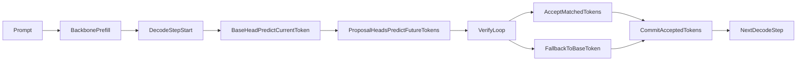
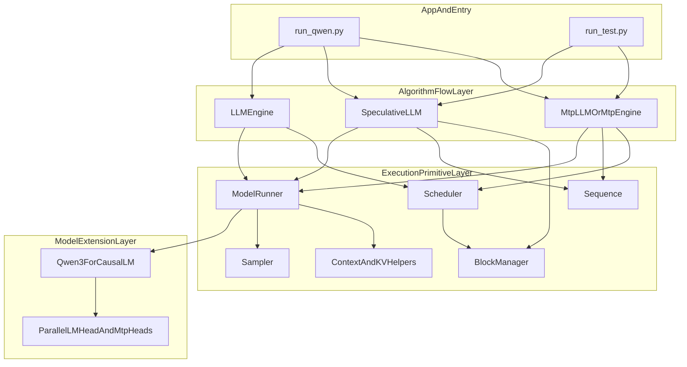

# MTP 方案设计

## 1. 背景

当前 `nano-vllm` 已经具备一个较完整的小型推理框架雏形，包含以下几个比较像样的工程点：

- 基于 `Scheduler + ModelRunner` 的生成主循环
- 预分配 `KV Cache` 和 block 管理
- `prefill / decode / recompute` 三种执行路径
- 张量并行与 `CUDA Graph` 的基础支持
- Qwen3 模型的最小可运行实现

如果只是把这个项目写成“手搓了一个 mini vLLM”，在简历上的辨识度还不够高。为了让项目从“复现型”进一步升级为“有算法和系统设计亮点的推理项目”，可以增加一种 `MTP-like speculative decoding` 能力。

这里的 `MTP` 指 `Multi-Token Prediction`。严格意义上的真 MTP，一般依赖训练阶段就具备的未来 token 预测头；而当前项目更适合先做一个**工程原型版**：

- 保持现有主模型结构和推理框架不大改
- 在模型顶部增加多个轻量 proposal heads
- 让单步 decode 扩展成“proposal -> verify -> accept / fallback”的多 token 流程
- 先完成接口、状态机、benchmark 和工程叙事
- 后续再自然升级为带蒸馏权重的真 MTP 版本

因此，本设计文档的目标不是“先把论文级 MTP 一次做到极致”，而是给当前 `nano-vllm` 设计一条**工程上可落地、项目上有亮点、后续也可扩展**的 MTP 路线。

## 2. 设计目标

本方案的目标有四个：

1. 在现有单模型生成框架上，增加 `MTP-like speculative decoding` 原型能力。
2. 保持原本普通 decode 路径可用，避免把当前项目主链路改坏。
3. 第一版尽量少碰复杂的 `Scheduler`、`eviction / recompute` 语义。
4. 为以后真正引入 MTP 训练权重预留清晰接口。

进一步说，第一版的核心不是“保证大幅提速”，而是：

- 证明当前推理框架能支持多 token proposal-verify 解码
- 证明模型定义、执行器、调度器之间的职责边界是清楚的
- 通过指标说明系统行为，例如接受率、fallback 率、吞吐变化

## 3. 为什么选 MTP，而不是双模型 speculative decoding

对当前仓库来说，其实有两条路线：

### 路线 A：双模型 speculative decoding

- 大模型作为 target / base model
- 小模型作为 draft model
- 小模型提出多个 token
- 大模型验证并接受一部分

优点：

- 更接近常见 speculative decoding 方案
- 容易讲“4B + 0.6B 双模型协同加速”

缺点：

- 需要维护两套模型状态和两套 KV cache
- 需要两条 block table / cache state
- 会让当前 `Sequence`、`Scheduler` 和资源管理复杂度明显上升

### 路线 B：单模型 MTP-like speculative decoding

- 仍然只有一个 backbone
- 主头负责当前 token 的真实预测
- 多个 future-token heads 负责后续 token 的 proposal
- 再由主头逐步 verify

优点：

- 不需要第二个模型
- 更适合往 `Qwen3ForCausalLM` 的顶部结构扩展
- 更适合在当前项目上体现“模型结构扩展 + 推理状态机设计”

缺点：

- 没有训练过的 MTP head 接受率通常不会太高
- 第一版更像工程原型，而不是强性能版本

综合来看，如果目标是**让项目更有亮点**，并且**尽量贴合当前代码结构**，那么单模型 `MTP-like speculative decoding` 是更合适的第一步。

## 4. 当前代码结构与最合适的落点

当前生成主链路大致如下：

- `nanovllm/engine/llm_engine.py`
  - `generate()`
  - `step()`
- `nanovllm/engine/scheduler.py`
  - `schedule()`
  - `postprocess_decode()`
  - `postprocess_recompute()`
- `nanovllm/engine/model_runner.py`
  - `prepare_prefill()`
  - `prepare_decode()`
  - `run_hidden_states()`
  - `run()`
- `nanovllm/models/qwen3.py`
  - `Qwen3Model`
  - `Qwen3ForCausalLM.forward()`
  - `compute_logits()`
- `nanovllm/layers/embed_head.py`
  - `ParallelLMHead`

这套结构有一个很重要的特点：

- `Qwen3ForCausalLM.forward()` 只负责跑 backbone，返回 hidden states
- `compute_logits()` 再单独把 hidden states 投到词表上

这意味着，模型其实已经天然具备“把单头 logits 扩展成多头 logits”的结构基础。  
也就是说，`MTP` 最自然的第一落点是：

- 在 `nanovllm/models/qwen3.py` 里增加 `mtp_heads`
- 在 `nanovllm/engine/model_runner.py` 里增加 proposal / verify 执行逻辑
- 在 `nanovllm/engine/llm_engine.py` 里增加 MTP decode 分支

而不是：

- 去改 attention kernel
- 去重写 block manager
- 去把 scheduler 一次性改成原生多 token 调度器

## 5. 总体方案

### 5.1 核心思路

第一版 `MTP` 采用如下思路：

- `head0` 仍然是现有 `lm_head`
- `head1..headK` 是若干 proposal heads
- 每轮 decode 中：
  - 主头先给出当前最可信的 token
  - proposal heads 给出后续 `K` 个 future token 的建议
  - 系统再用主头在滚动前缀上逐步验证这些 proposal
  - proposal 命中则接受
  - proposal 不命中则退回主头 token

这个流程本质上是一个：

`single-backbone, multi-head proposal-verify decoding`

也就是单模型、多头、带验证的 MTP-like speculative decoding。

### 5.2 为什么第一版不做回滚式 verify

如果想做非常“正宗”的 speculative decode，通常会遇到一个问题：

- draft 一次提出多个 token
- verify 过程中如果在中间某个位置失败
- 就需要处理 KV cache 是否回滚、是否复用、如何对齐后续状态

这在当前 `nano-vllm` 结构里代价很高，因为现有 cache 语义基本建立在：

- `Sequence` 只维护一条单模型状态
- `BlockManager` 假设 token 是按真实生成顺序 append 的
- `Scheduler` 的 decode 语义本质上是“一步追加一个 token”

因此第一版不建议引入复杂 rollback。更稳妥的策略是：

- 主头先产生本轮真实 token
- 只有已经确定可接受的 token 才真正写回最终序列
- proposal 只作为“候选建议”

这样可以避免很多 cache 一致性问题。

## 6. 模型层设计

### 6.1 文件落点

模型层主要改动：

- `nanovllm/models/qwen3.py`
- `nanovllm/layers/embed_head.py`
- `nanovllm/config.py`

### 6.2 Qwen3ForCausalLM 的扩展

在 `Qwen3ForCausalLM` 中新增：

- `self.enable_mtp`
- `self.mtp_num_heads`
- `self.mtp_heads`
- 可选 `self.mtp_lm_heads`

目标结构如下：

- `lm_head` 仍负责当前 token logits
- 每个 `mtp_head` 负责把同一个 hidden state 变换成“预测未来第 i 步 token”的 hidden
- 再映射到词表空间

### 6.3 proposal head 的建议结构

第一版 proposal head 不建议做得太重，推荐采用轻量结构：

- `RMSNorm`
- `Linear(hidden, hidden)`
- 可选一个 step embedding / residual bias
- 最后接 `ParallelLMHead`

理由：

- 参数量小
- 易于实现
- 容易共享或复用现有 `lm_head`
- 以后替换成真正训练得到的 MTP 权重也更自然

### 6.4 是否共享 LM Head

第一版建议支持两种模式：

- `mtp_share_lm_head = True`
  - proposal head 只负责 hidden transformation
  - 最终词表投影仍然复用现有 `lm_head`
- `mtp_share_lm_head = False`
  - 每个 proposal head 单独拥有一个词表投影头

推荐默认：

- 第一版默认共享 `lm_head`

理由：

- 参数更省
- 结构更简单
- 更符合“工程原型”的定位

### 6.5 compute_mtp_logits 接口

建议新增：

- `compute_mtp_logits(hidden_states, num_heads=None)`

返回形式建议为：

- `base_logits`
- `proposal_logits`

其中：

- `base_logits` 形状为 `[B, vocab]`
- `proposal_logits` 形状为 `[B, K, vocab]`

这样有几个好处：

- 主头输出和 proposal 输出语义区分清楚
- 不破坏现有 `compute_logits()` 路径
- `ModelRunner` 更容易直接接 proposal / verify 逻辑

### 6.6 prefill 的特殊问题

当前 `ParallelLMHead` 在 prefill 阶段只取每个序列最后一个 token 的 hidden states。  
这对普通 decode 是合理的，但对 MTP 来说有一个注意点：

- 如果未来想在 prefill 阶段直接计算更多位置的 proposal 信息，就不能完全复用当前“只取最后位置”的逻辑

因此第一版建议：

- 先把 MTP 的重点放在 decode 阶段
- `compute_mtp_logits()` 内部自己控制 hidden state 的选择逻辑
- 不要让 proposal 路径完全依赖 `ParallelLMHead.forward()` 的默认 prefill 行为

## 7. 执行器层设计

### 7.1 文件落点

执行器层主要改动：

- `nanovllm/engine/model_runner.py`

### 7.2 现有问题

当前 `ModelRunner.run()` 把几个步骤绑得很死：

- 准备输入
- 跑 backbone
- 计算 logits
- 采样一个 token

这在普通 decode 下没问题，但在 MTP 场景里不够灵活，因为你需要：

- 单独拿 hidden states
- 单独拿主头 logits
- 单独拿 proposal logits
- 单独对 verify 过程做控制

### 7.3 建议拆分的接口

建议把 `ModelRunner` 拆成更细粒度的接口：

- `forward_hidden_states(seqs, mode)`
- `forward_logits(seqs, mode)`
- `forward_mtp_logits(seqs, mode, num_heads=None)`
- `sample_from_logits(logits, temperatures, greedy=False)`
- `mtp_run(seqs, mode)`

接口职责如下：

#### 1. forward_hidden_states

职责：

- 负责 `prepare_prefill / prepare_decode`
- 负责设置 context
- 负责调用 `run_hidden_states()`
- 返回 backbone hidden states

#### 2. forward_logits

职责：

- 调用 `forward_hidden_states`
- 调用主头 `compute_logits`
- 返回主头 logits

#### 3. forward_mtp_logits

职责：

- 调用 `forward_hidden_states`
- 调用 `compute_mtp_logits`
- 返回主头 logits 和 proposal logits

#### 4. sample_from_logits

职责：

- 统一处理 greedy 或常规采样
- 让普通 decode 和 MTP verify 共享同一套采样入口

#### 5. mtp_run

职责：

- 真正执行 proposal -> verify -> accept / fallback 状态机
- 返回“本轮每个请求接受了哪些 token”
- 同时返回统计信息

### 7.4 mtp_run 的建议流程

第一版 `mtp_run()` 仅在 `decode` 模式下启用。

伪流程如下：

1. 对当前批次先跑一次 backbone
2. 主头生成本轮第一个真实 token
3. proposal heads 生成后续 `K` 个候选 token
4. 对每个请求逐步 verify
5. 将可接受 token 打包成 `list[list[int]]`
6. 返回给 `LLMEngine` 做统一后处理

### 7.5 verify 语义

第一版 verify 建议采用以下定义：

- 当前步的第一个 token 由主头直接产出
- 后续 proposal token 逐个验证
- 每验证一步，都把“已经接受的 token”视为真实前缀
- 一旦 proposal token 与主头 verify 结果不一致：
  - 接受 verify 得到的主头 token
  - 结束该请求本轮的 MTP 验证

这个定义虽然不是最激进的 speculative 流程，但它非常适合当前项目，因为：

- 不需要显式 rollback
- 不要求 block manager 懂 proposal token 的临时状态
- 不需要改动 attention / cache kernel

### 7.6 为什么 mtp_run 不直接改 Scheduler

如果一开始就把 `Scheduler` 改成原生多 token 调度，会牵涉：

- 不同请求接受 token 数不同
- batch 内请求进度错位
- eviction / recompute 如何和多 token 前进兼容
- block append 是否按步还是按段处理

这对第一版来说改动面太大。  
因此更合理的做法是：

- `Scheduler` 仍然只负责把当前可执行序列挑出来
- `mtp_run()` 内部完成多 token proposal-verify
- 上层仍按“真实接受 token”逐个 append

这样系统边界更清晰。

## 8. 引擎层设计

### 8.1 文件落点

引擎层主要改动：

- `nanovllm/engine/llm_engine.py`

### 8.2 设计目标

目标不是重写 `LLMEngine`，而是在保留旧路径的前提下增加新模式。

建议引入一个配置分支：

- `decoding_backend = "base" | "mtp"`

或者直接通过 `config.enable_mtp` 控制。

### 8.3 step 的新分支

`step()` 中：

- 原路径：
  - `model_runner.run(seqs, mode)`
  - `scheduler.postprocess_decode(seqs, token_ids)`

- MTP 路径：
  - `model_runner.mtp_run(seqs, mode)`
  - `postprocess_decode_multi(seqs, accepted_token_lists)`

### 8.4 postprocess_decode_multi

建议新增一个小函数，只做一件事：

- 把 `list[list[int]]` 的真实接受结果逐 token 写回 `Sequence`

内部逻辑仍然复用原有规则：

- 调 `seq.append_token(token_id)`
- 检查 `eos`
- 检查 `max_tokens`
- 必要时释放 block

这样做的最大优点是：

- `Scheduler` 不用一开始就支持“多 token 原生调度”
- `Sequence` 仍然维持当前追加语义
- 普通路径和 MTP 路径都可以复用大部分收尾逻辑

## 9. Sequence 与 Scheduler 设计

### 9.1 Sequence 第一版不大改

当前 `Sequence` 已经承担：

- token 状态
- cache 状态
- completion 状态

第一版不建议把它改成复杂的“proposal token + committed token”双状态结构。  
建议保持简单：

- 只有真正被接受的 token 才 append 到 `Sequence`
- proposal 只存在于 `mtp_run()` 的局部逻辑中

如有需要，可以增加两个小工具方法：

- `append_tokens(token_ids: list[int])`
- `fork()`

其中：

- `append_tokens` 便于多 token 写回
- `fork` 便于 verify 时构造临时工作序列

### 9.2 recompute / eviction 的策略

当前项目已经存在：

- prefix eviction
- recompute 恢复

这部分和 MTP 一起处理会很复杂，因此第一版建议明确限制：

- 当 `seq.recompute_pending == True` 时，不启用 MTP
- 一旦请求进入 recompute，自动降级为普通 decode

这个限制是合理的，因为：

- 可以显著减少复杂度
- 依旧不影响功能正确性
- 后续可以作为项目继续优化的方向

### 9.3 为什么不在第一版深改 BlockManager

`BlockManager` 当前语义很清晰：

- allocate
- may_append
- deallocate
- evict_prefix
- restore_prefix

如果 proposal token 不真正写入 block，那么它不需要理解 proposal 的临时生命周期。  
因此第一版建议：

- `BlockManager` 不感知 proposal token
- 只对最终 accepted token 负责

这样可以最大程度减少风险。

## 10. 配置设计

### 10.1 配置项建议

在 `nanovllm/config.py` 中建议新增：

- `enable_mtp: bool = False`
- `mtp_num_heads: int = 2`
- `mtp_draft_len: int = 2`
- `mtp_verify_mode: str = "greedy"`
- `mtp_disable_on_recompute: bool = True`
- `mtp_share_lm_head: bool = True`
- `mtp_head_scale: float = 0.1`

### 10.2 各字段含义

#### enable_mtp

是否启用 MTP 路径。

#### mtp_num_heads

模型里实际挂载多少个 proposal heads。

#### mtp_draft_len

每轮 decode 最多尝试提议多少个 future token。

#### mtp_verify_mode

验证时使用：

- `greedy`
- `sample`

第一版建议默认：

- `greedy`

这样结果更稳定，benchmark 更容易解释。

#### mtp_disable_on_recompute

遇到 recompute / eviction 恢复阶段时是否自动降级。

第一版建议默认：

- `True`

#### mtp_share_lm_head

proposal head 是否共享现有 `lm_head` 的词表投影。

#### mtp_head_scale

proposal residual transform 的缩放系数。

## 11. benchmark 与实验设计

如果没有 benchmark，这个项目的 MTP 方案就很难讲出价值。  
因此第一版一定要加实验指标。

### 11.1 至少记录的指标

- `acceptance_rate`
  - proposal token 中最终被接受的比例

- `avg_accepted_tokens_per_step`
  - 每轮平均接受多少个 token

- `fallback_rate`
  - proposal 验证失败后退回主头 token 的比例

- `decode_tokens_per_sec`
  - 解码吞吐

- `speedup_vs_baseline`
  - 相对普通 decode 的速度对比

### 11.2 为什么第一版也要做指标

因为第一版没有训练过的 proposal heads，很可能出现：

- proposal 质量不高
- acceptance rate 偏低
- 速度提升不稳定，甚至可能没有明显收益

这并不意味着方案没价值。  
相反，只要指标是完整的，你就可以在项目叙事中明确说明：

- 第一版重点是打通架构和执行链路
- acceptance rate 受限于 proposal heads 未经蒸馏训练
- 但推理框架已为后续真 MTP 训练权重接入准备好了接口

这其实是一个非常成熟的工程叙事。

### 11.3 实验建议

建议至少做两组对比：

#### 1. baseline

- 普通单头 decode

#### 2. MTP prototype

- 开启 proposal heads
- greedy verify
- 固定 `mtp_num_heads = 2` 或 `4`

### 11.4 评估维度

建议同时观察：

- 短 prompt
- 中等 prompt
- 不同 max_tokens
- batch size = 1
- 小 batch 场景

第一版不要一开始就覆盖太多组合，优先保证结论清晰。

## 12. 第一版范围边界

为了确保工程复杂度可控，第一版建议主动限制范围。

### 12.1 包含内容

- 单模型 MTP-like speculative decoding
- proposal heads
- 主头 verify
- `ModelRunner` 分层接口
- `LLMEngine` 新增 MTP 分支
- benchmark 和统计输出

### 12.2 不包含内容

- 第二个 draft model
- 双模型 KV cache 状态维护
- 真正训练好的 MTP head 权重
- 深度融合 eviction / recompute
- graph 内 proposal / verify 全链路优化
- attention kernel 级别优化

### 12.3 为什么要这样切

因为如果第一版什么都想做，最后很可能：

- 改动面太大
- bug 太多
- 主链路也被改坏
- benchmark 结论也讲不清楚

而主动限制范围后，反而更容易：

- 几天内跑通
- 输出清晰的实验数据
- 保留后续升级空间

## 13. 关键风险与应对

### 风险 1：proposal heads 没训练过，接受率可能低

这是第一风险，也是一定会被问到的问题。

应对方式：

- 在文档和 benchmark 中明确说明这是工程原型
- 强调接口和执行链路已经搭好
- 把“用蒸馏训练 proposal heads”作为下一阶段升级路线

### 风险 2：MTP 路径可能比 baseline 更慢

由于 verify 增加了额外前向，第一版很可能并不会立即显著提速。

应对方式：

- 第一版把目标从“立刻提速”调整为“完成 proposal-verify 原型”
- benchmark 中同时报告吞吐和 acceptance rate
- 通过分析说明性能瓶颈在哪

### 风险 3：与 recompute / eviction 的语义冲突

应对方式：

- 第一版直接降级
- 只有无 recompute 的请求使用 MTP

### 风险 4：prefill 逻辑和 proposal logits 的 hidden 选择不一致

应对方式：

- proposal 路径单独控制 hidden state 选择逻辑
- 不完全依赖 `ParallelLMHead.forward()` 的默认 prefill 处理

### 风险 5：CUDA Graph 与 MTP 分支兼容性有限

当前 `CUDA Graph` 主要覆盖 backbone decode。  
proposal / verify 由于控制流更复杂，第一版建议：

- backbone 仍可保留 graph
- proposal / verify 先放 graph 外

这符合“先功能、后性能”的节奏。

## 14. 后续升级路线

如果第一版跑通，后续可以按以下顺序升级。

### 阶段 1：更稳定的工程版

- 支持更多 batch 场景
- 完善统计信息
- 改善 verify 流程的实现效率

### 阶段 2：更强的模型版

- 为 `mtp_heads` 引入蒸馏或继续训练权重
- 显著提升 acceptance rate

### 阶段 3：更完整的系统版

- 和 `recompute / eviction` 深度融合
- 优化 block append 行为
- 尝试更批量化的 verify

### 阶段 4：更高性能版

- 减少 Python 循环
- 压缩 proposal / verify 临时张量
- 探索把更多路径纳入 `CUDA Graph`

## 15. 数据流

## 16. 对外表述建议

如果这个项目最后写到简历里，建议不要写成：

- “实现了完整 MTP 推理系统”

这种说法会过满。

更合适的表达是：

- 在自研 mini-vLLM 推理框架中实现 `MTP-like speculative decoding` 原型，将单 token decode 扩展为 proposal-verify 多 token pipeline
- 设计并实现基于 `Qwen3 backbone + multi-head proposals` 的单模型投机解码方案，兼容现有 `KV cache / scheduler / block manager`
- 为未来接入蒸馏训练的真实 MTP 权重预留 `compute_mtp_logits / mtp_run` 等接口

这样写的好处是：

- 技术亮点真实
- 系统感强
- 不会被面试时一问就露出“其实只是个概念”

## 17. 一句话结论

这个 `MTP` 方案最合理的落地方式，不是把当前框架彻底推翻重写，而是：

**保留现有单模型 decode 主链路，在 `Qwen3ForCausalLM` 顶部增加 proposal heads，在 `ModelRunner` 中新增 proposal-verify 执行路径，在 `LLMEngine` 中新增多 token 写回分支，并通过 benchmark 把它包装成一个可升级的 MTP 工程原型。**

## 18. 代码分层图与文件边界

这一节专门回答一个工程问题：

- 以后如果继续改当前双模型 `speculative decoding`
- 同时又要新增或迭代 `MTP`
- 怎么避免两套逻辑互相缠住，导致改一处就要到处同步改

核心原则只有一句话：

**共享底层执行原语，不共享算法流程状态机。**

也就是说：

- `speculative decoding` 和 `MTP` 可以共用“前向 / logits / verify / sample”这类底层能力
- 但不要让 `MTP` 直接复用 `SpeculativeLLM` 的双模型控制流
- 也不要让 `SpeculativeLLM` 成为 `MTP` 的父类或基类

### 18.1 推荐代码分层

推荐把相关代码分成三层：

1. 底层执行原语层
2. 算法流程层
3. 模型扩展层

这三层的职责必须明确分开。

### 18.2 分层图

这个图想表达的是：

- `SpeculativeLLM` 和未来的 `MtpLLM` 应该是并列关系
- 两者都依赖 `ModelRunner` 提供底层执行能力
- 但两者各自维护自己的 proposal / verify / fallback 状态机
- `MTP` 独有的模型结构改动只应该落在 `Qwen3ForCausalLM + mtp heads`

### 18.3 哪些文件应该共享

下面这些文件或模块应该作为共享层保留下来，供普通 decode、双模型 speculative、MTP 一起使用。

#### 1. `nanovllm/engine/model_runner.py`

这是最重要的共享层。

适合共享的能力包括：

- `forward_hidden_state()`
- `forward_logits()`
- `forward_verify_logits()`
- `sample_from_logits()`
- proposal 和 verify logits 的比对辅助函数

也就是说，`ModelRunner` 应该尽量只提供“执行原语”，不要在这里写死：

- draft/base 双模型语义
- MTP 多头专属控制流
- 某一种具体 speculative 算法的完整主循环

更理想的职责是：

- 负责把 `Sequence + mode` 变成可执行的模型前向
- 负责返回 hidden states / logits / verify logits
- 负责一些尽量无状态的辅助比对逻辑

#### 2. `nanovllm/engine/sequence.py`

`Sequence` 仍然应该是共享的基础序列结构。

它适合承载：

- token ids
- prompt / completion 计数
- block table
- cache 生命周期

但不适合承载：

- 双模型 speculative 的 `base_state + draft_state`
- MTP 的 proposal 临时状态

也就是说，`Sequence` 只保留“单条真实序列”的通用状态，不承载某种算法的额外控制流。

#### 3. `nanovllm/engine/scheduler.py`

`Scheduler` 也应该是共享层，但只共享“通用调度”能力。

适合共享：

- prefill / decode / recompute 的调度框架
- 和 `BlockManager` 的交互

不适合一开始就放进去的内容：

- 双模型 speculative 的 draft/base 协同逻辑
- MTP 的 proposal 接受数量差异逻辑

建议：

- 第一版 `MTP` 和当前 `SpeculativeLLM` 都尽量少侵入 `Scheduler`
- 等算法真正稳定后，再决定是否把一部分逻辑并回主调度器

#### 4. `nanovllm/engine/block_manager.py`

`BlockManager` 也应该尽量保持共享，但只服务于“真实已提交 token”。

不要让它在第一版就理解：

- speculative proposal token 的临时生命周期
- MTP proposal token 的半提交状态

否则会导致 block 语义迅速复杂化。

#### 5. `nanovllm/layers/sampler.py`

采样逻辑显然应该共享。

但建议把“如何从 proposal logits 做接受判断”这类逻辑保留在算法层，而不是塞进 `Sampler`。

#### 6. `nanovllm/utils/context.py`

上下文、slot mapping、block tables 这些都应作为共享执行基础设施继续保留。

### 18.4 哪些文件必须分开

下面这些部分必须和当前双模型 speculative 解耦，单独实现。

#### 1. `nanovllm/speculative_llm.py`

这个文件应该继续专注于：

- 双模型 draft/base speculative decoding
- draft propose
- base verify
- reject 后 resync draft

这是一套非常明确的双模型状态机。  
它不应该承担：

- MTP 多头 proposal
- 单模型 internal verify
- MTP 模型结构管理

换句话说，`SpeculativeLLM` 不是 `MTP` 的父类，也不应该被 `MTP` 继承。

#### 2. 新增 `nanovllm/mtp_llm.py` 或 `nanovllm/mtp_engine.py`

建议给 `MTP` 单独建一个文件。

它负责：

- 组织 `compute_mtp_logits()`
- 执行 proposal -> verify -> accept / fallback
- 管理 MTP 独有统计项
- 决定何时降级回普通 decode

这样以后你改：

- 双模型 speculative 的 resync 策略
- draft length
- verify 方式

并不会强迫你同步修改 `MTP`。

#### 3. `nanovllm/models/qwen3.py`

`MTP` 对模型结构的扩展必须独立落在这里。

这里可以新增：

- `mtp_heads`
- `compute_mtp_logits()`
- proposal head 配置项

这部分和当前双模型 speculative 没关系，因此不能混到 `speculative_llm.py` 里。

#### 4. `nanovllm/layers/embed_head.py`

如果为了 `MTP` 增加：

- 多头 logits projection
- 更灵活的 last-token / all-token 选择逻辑

这些改动应该明确是“模型输出层能力扩展”，而不是 speculative 专属逻辑。

### 18.5 推荐的文件归属表

下面给出一个更直观的归属建议。

#### 共享层

- `nanovllm/engine/model_runner.py`
- `nanovllm/engine/sequence.py`
- `nanovllm/engine/scheduler.py`
- `nanovllm/engine/block_manager.py`
- `nanovllm/layers/sampler.py`
- `nanovllm/utils/context.py`
- `nanovllm/llm.py`

#### 双模型 speculative 专属

- `nanovllm/speculative_llm.py`

#### MTP 专属

- `nanovllm/mtp_llm.py` 或 `nanovllm/mtp_engine.py`
- `nanovllm/models/qwen3.py` 中的 `mtp_heads / compute_mtp_logits`
- `nanovllm/layers/embed_head.py` 中与 MTP logits 投影直接相关的扩展

#### 入口与实验

- `run_qwen.py`
- `run_test.py`
- 未来单独的 `bench_mtp.py` / `bench_speculative.py`

### 18.6 最重要的边界规则

为了防止以后维护变得很痛，建议遵守下面几条规则。

#### 规则 1：算法层不能互相继承

不要做成：

- `class MtpLLM(SpeculativeLLM)`

因为 `SpeculativeLLM` 的核心假设是：

- 两个模型
- 两套状态
- draft/base 对齐

而 `MTP` 的核心假设是：

- 一个 backbone
- 一个主头
- 多个 future-token heads

这两种状态机不是同一种东西。

#### 规则 2：共享层只放“能力”，不放“策略”

例如：

- `forward_logits()` 是能力
- “先 draft propose 再 base verify” 是策略
- “先主头给当前 token，再 proposal heads 给未来 token” 也是策略

能力可以共享，策略必须分开。

#### 规则 3：共享接口命名尽量中性

例如当前如果有：

- `verify_draft_tokens()`

那么更推荐逐步改成中性命名：

- `verify_proposed_tokens()`
- `match_proposals_against_logits()`

这样接口就不会天然绑死在双模型 draft/base 语义上，`MTP` 也能直接复用。

#### 规则 4：模型结构扩展只能放模型层

凡是涉及：

- 新的 logits head
- hidden state transformation
- MTP proposal heads

都应该落在 `qwen3.py` 或相关 layer 文件，而不是塞进算法层脚本里。

### 18.7 推荐演进路径

如果按后续维护成本最低的方式演进，建议顺序如下：

1. 继续把 `ModelRunner` 抽成稳定的共享执行原语层
2. 保持 `SpeculativeLLM` 只做双模型 speculative
3. 新增独立的 `MtpLLM` 或 `MtpEngine`
4. 在 `Qwen3ForCausalLM` 中接入 `mtp_heads`
5. 只在最后一步再考虑是否把某些稳定逻辑并入 `LLMEngine / Scheduler`

### 18.8 一句话建议

如果你后面确定还会继续重构当前 `speculative decoding`，那么最好的代码组织方式就是：

**把 `SpeculativeLLM` 和未来的 `MTP` 视为两种并列算法实现，它们共享 `ModelRunner` 这一层执行原语，但绝不共享彼此的控制流状态机。**
